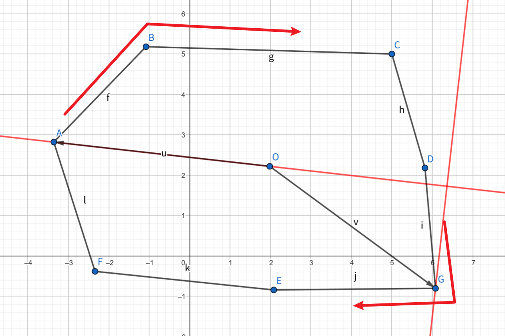
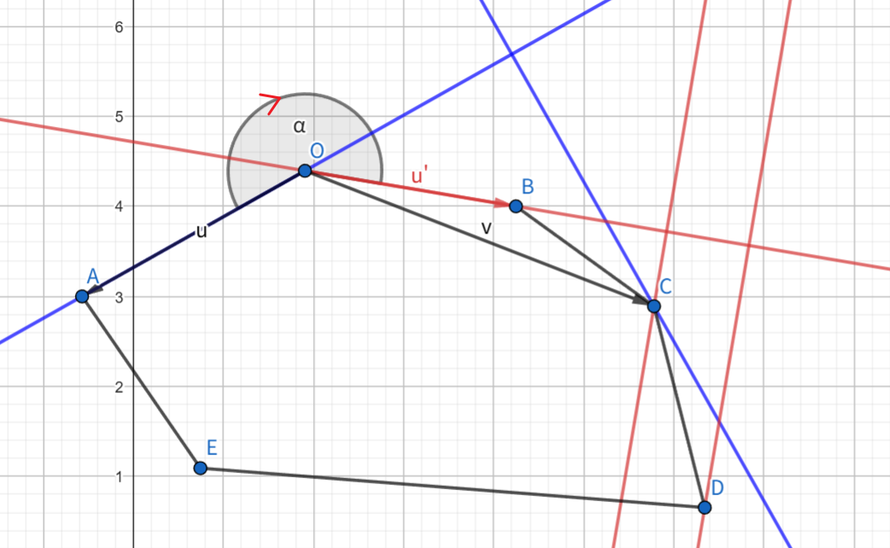

# 训练记录

すべてはここから

> 这个Repository其实是用来放平时训练的代码的
> 因为写起来舒服所以就直接用README来写训练记录了

## 2025年3月

### 牛客周赛 87

#### [小苯的V图](https://ac.nowcoder.com/acm/contest/105623/A)

水题，[Code](./nowcoder/牛客周赛-Round-87/A.cpp)

#### [小苯的数字切割](https://ac.nowcoder.com/acm/contest/105623/B)

水题，[Code](./nowcoder/牛客周赛-Round-87/B.cpp)

#### [小苯的Z串匹配](https://ac.nowcoder.com/acm/contest/105623/C)

水题，[Code](./nowcoder/牛客周赛-Round-87/C.cpp)

#### [小苯的最大和](https://ac.nowcoder.com/acm/contest/105623/D)

Tag: 线性DP

很典的线性DP，没有归成水题是因为我是 DP 苦手，[Code](./nowcoder/牛客周赛-Round-87/D.cpp)

#### [小苯的数组构造](https://ac.nowcoder.com/acm/contest/105623/E)

Tag: 贪心，构造

比较恶心的点就是需要满足 $a_i > 0$ 吧，贪心一下尽可能多覆盖一下就好了。挺水的。[Code](./nowcoder/牛客周赛-Round-87/E.cpp)

#### [小苯的ovo2.0](https://ac.nowcoder.com/acm/contest/105623/F)

Tag: Guess，贪心

注意到如果整个字符串都是任意选择的，那么一定是中间的某一段选择 'v'，然后两边选择 'o'。这是一个简单的贪心结论。

然后直接猜测对于只能选择部分字符的情况也满足这种情况。直接 $O(n^2)$ 枚举区间然后 $O(n)$ check就过了。

[Code](./nowcoder/牛客周赛-Round-87/F.cpp)

### 3月31日

#### [Yet Another Real Number Problem](https://codeforces.com/contest/2035/problem/D)

Tag: 单调栈

CF Rating: 1800

显然一个数字 $a_i$ 可以被拆成 $x\cdot 2^{t}$，那么这题的操作就是重新分配 $2^t$，且只能向后传
递。

考虑已经计算完了 $f(i - 1)$，那么只需要考虑插入一个数字 $a_i$，应该如何分配 $2^t$。显然只可能出现前面的数字传递给 $a_i$ 的情况，因为前面的安排已经是最好的了。前面的安排一定是全部的 $2^t$ 集中在若干个数字上，那么我们需要考虑的是：将哪些数字上的 $2$ 传递给当前数字。

容易想到，越是靠后的这些数字，越是和 $2$ 不适配，否则前面的 $2$ 就会直接给到后面来了，也就是具有一个单调性。那么我们每次只需要判断最后面的数字是否需要向当前数字提供 $2$ 即可。判断方式需要计算是否提供 $2$ 这两种情况下的贡献，两个作比较可以得到一条不等式。

[Code](./Codeforces/2035/2035D.cpp)

## 2025年4月

### 4.1

#### [Monster](https://codeforces.com/contest/2035/problem/E)

Tag: 整除分块

CF Rating: 2300

简单的贪心结论：一定是先升级若干次（中间可能强行发动攻击若干次）后，只发动攻击不升级，直到怪物死亡。

考虑没有限制升级 $k$ 次后强行发动攻击的限制，那么显然有：如果你攻击次数相同，那么升级没有用。攻击次数的计算公式是：$\lceil \frac{n}{d} \rceil$，所以可以想到整除分块，因为对于 $\lceil \frac{n}{d} \rceil$ 相等的 $d$，代价都是一样的。

这是一个上取整的整除分块，和下取整的有所不同。因为上取整的公式为 $\lceil \frac{n}{d} \rceil = \lfloor\frac{n + d - 1}{d}\rfloor$。所以 $\lceil \frac{n}{x} \rceil = \lceil \frac{n}{y} \rceil$ 等价于 $\lfloor \frac{n - 1}{x} \rfloor = \lfloor \frac{n - 1}{y} \rfloor$。这就变成了一个下取整的整除分块问题了。需要注意的是当 $x \geq n$ 的时候，右端点为 $\inf$，不能直接计算，会出现除零错误。其实这个问题在下取整的时候也是存在的，只是似乎见的比较少所以都没注意而已。

```cpp
for (int x = 1; x <= n; ++x) {
    i64 l = x;
    i64 r = min(n, x >= m ? INF : (m - 1) / ((m - 1) / x));
    f((m + x - 1) / x);
    x = r;
}
```

考虑按照被迫使用攻击操作的次数进行分类。那么就有自带等级，并且怪物血量被提前削减，这都是容易解决的。只要你升级次数在 $k$ 以内就不会出现被迫发动攻击的情况。这个时候就可以使用上面提到的解法解决了。

[Code](./Codeforces/2035/2035E.cpp)

### 4.3

#### [红魔塔](https://ac.nowcoder.com/acm/contest/106509/A)

水题, [Code](./nowcoder/牛客练习赛136/A.cpp)

#### [冰冻青蛙](https://ac.nowcoder.com/acm/contest/106509/B)

水题, [Code](./nowcoder/牛客练习赛136/B.cpp)

#### [灵梦的字符串问题](https://ac.nowcoder.com/acm/contest/106509/C)

Tag: 模拟, 贪心

注意到如果当前字符比后面第一个和当前字符不相等的字符大，那么一定是有操作后的字典序小于不操作的。考虑到有代价限制，所以是优先选择靠前的位置操作。但是这样有一个问题，如果是相同的一段字符，那么选择哪个字符都是一样的，所以在这种情况下是优先选择代价小的。

那么一个比较优雅的写法就是将成块的字符对代价数组 $a$ 排序，这样就能统一成：靠前的操作点优先选择。

[Code](./nowcoder/牛客练习赛136/C.cpp)

#### [幽幽子的魔法宴会](https://ac.nowcoder.com/acm/contest/106509/D)

Tag: 贪心，思维

注意到如果我 $x$ 的最高位固定，那么进行操作的 $a_i$ 也是确定的。所以考虑枚举 $x$ 的最高位，然后先尝试拉满贡献，然后再考虑降低代价。

枚举 $x$ 的最高位：如果 $a_i$ 在该位为 $1$，那么这个数不进行操作，否则这个数一定进行操作。

拉满贡献：因为哪些数进行操作是已知的，这样对于每一个位，可以通过投票的方式少数服从多数来决定这位是否为 $1$。

拉满贡献之后如果是满足要求的，那么考虑降低代价。从高位到低位考虑每个 $1$ 的位置，如果可以删除就删除，也是经典贪心了。

坑点：特判 $x = 0$，因为枚举最高位的时候没有考虑不存在最高位。没判这个调红温了。

[Code](./nowcoder/牛客练习赛136/D.cpp)

### Edu177

#### [A. Cloudberry Jam](https://codeforces.com/contest/2086/problem/A)

水题: 直接输出 $2n$ 即可. [Code](./Codeforces/2086/2086A.cpp)

#### [B. Large Array and Segments](https://codeforces.com/contest/2086/problem/B)

水题, 直接暴力枚举即可. [Code](./Codeforces/2086/2086B.cpp)

std::二分

```cpp
int p = lower_bound(suf.begin() + 1, suf.end(), need, [](i64 ai, i64 x) {
    return !(ai < x);
});
int p = upper_bound(suf.begin() + 1, suf.end(), need, [](i64 x, i64 ai) {
    return ai < x;
});
int p = partition_point(suf.begin() + 1, suf.end(), [&](i64 ai) {
    return !(ai < x);
});
```

这三个等价

#### [C. Disappearing Permutation](https://codeforces.com/contest/2086/problem/C)

水题, 排列判环. [Code](./Codeforces/2086/2086C.cpp), 下面是板子

```cpp
for(int u = x; !vis[u]; vis[u] = 1, u = p[u]) {
    ans++;
}
```

#### [D. Even String](https://codeforces.com/contest/2086/problem/D)

Tag: 背包dp

注意到每一种字符要么全放在奇数位置，要么全放在偶数位置。总共 $O(1)$ 种决策。$dp(i)$ 表示奇数位置已经被占用了 $i$ 个的情况下的方案数。通过奇数可以计算出偶数被占用的位置有多少个。

假设我们可以计算出当前奇数位置有 $x$ 个空位，偶数位置有 $y$ 个空位，当前需要放入 $k$ 个字符，那么有：

$$
\begin{aligned}
ndp(\lceil \frac{n}{2} \rceil - x + k) &\leftarrow dp(\lceil \frac{n}{2} \rceil - x) \cdot C_{x}^{k}\\
ndp(\lceil \frac{n}{2} \rceil - x) &\leftarrow dp(\lceil \frac{n}{2} \rceil - x) \cdot C_{y}^{k}\\
\end{aligned}
$$

[Code](./Codeforces/2086/2086D.cpp)

#### [E. Zebra-like Numbers](https://codeforces.com/contest/2086/problem/E)

Tag: 预处理

考虑使用前缀和-差分的方式计算 $[0, r]$ 中 $f(x) = k$ 的个数减去 $[0, l)$ 中 $f(x) = k$ 的个数。记 $dp(i, j)$ 为：只使用前 $i$ 个斑马数的情况下，满足 $f(x) = j$ 的 $x$ 的个数。计算 $[0, n]$ 中满足 $f(x) = k$ 的个数可以“拆位”计算，计算方式可以参考代码理解一下。有点像是数位dp，这一位取最大和这一位不取最大。

```cpp
i64 solve(i64 n, i64 k) {
    i64 ans = 0;
    for(int i = 30; i > 0; --i) {
        if(n >= zebra[i]) {
            int x = n / zebra[i];
            n %= zebra[i];
            for(int j = 0; j < x; ++j) {
                if(k - j < 0) break;
                ans += dp[{i - 1, k - j}];
            }
            k -= x;
        }
        if(k < 0) break;
    }
    return ans + (k == 0);
}
```

[Code](./Codeforces/2086/2086E.cpp)

### Edu152

#### [A. Morning Sandwich](https://codeforces.com/contest/1849/problem/A)

水题, [Code](./Codeforces/1849/1849A.cpp)

#### [B. Monsters](https://codeforces.com/contest/1849/problem/B)

如果怪物不能被一击必杀, 那么它的血量大于 $k$, 那么它一定会在出现怪物死亡之前被攻击直到进入一击必杀状态. 考虑所有怪物都是一击必杀状态且没有怪物死亡, 那么怪物一定是按照血量降序, 位置升序的方式死亡.

直接 `map<int, vector<int>>` 表示怪物血量 (一击必杀态时) 的桶. 倒序枚举即可. [Code](./Codeforces/1849/1849B.cpp)

#### [C. Binary String Copying](https://codeforces.com/contest/1849/problem/C)

Tag: 哈希

解法一: 注意到需要找本质不同的字符串的个数, 考虑使用哈希求解.  考虑一次操作, 我们不可能真的对字符串进行排序, 但是排序的结果我们是知道的, 那么我们可以考虑手动 $O(1)$ 计算操作后的字符串的哈希值.

具体的操作是: 计算出排序后区间的哈希值贡献, 替换掉原本这段区间的哈希值贡献. 就可以得到整个字符串的哈希值. 把 $m$ 次操作后的哈希值塞到一个 `set` 里面输出 `size` 即可.

字符串哈希的公式为:

$$
H = \sum\limits_{i = 1}^{n} s_i \cdot x^{n - i}
$$

字符串是右对齐的, 左移 $k$ 位需要乘上 $x^k$

[Code](./Codeforces/1849/1849C.cpp)

解法二: 找本质相同的区间. 对于一个区间 $[l, r]$ 来说, 如果 $s_l = 0$, 那么这个区间和本质和 $[l + 1, r]$ 相同. 既然如此, 可以考虑于这个区间本质相同的最小的区间. 具体解法是预处理出每个位置往右的第一个 $1$ 和往左的第一个 $0$. 然后直接 `l = rgt[l], r = lft[r]` 即可. 如果区间长度小于等于 $0$ 说明本次没有进行操作, 可以使用一个 `flag` 记录操作后是否存在原串.

这个解法没写代码, 可以参考 jiangly 的写法.

#### [D. Array Painting](https://codeforces.com/contest/1849/problem/D)

Tag: 数据结构 + dp

对于 $a_i = 0$, 有 $dp(i) = \max(dp(i), dp(i - 1) + 1)$

对于 $a_i = 1$, 可以通过向左边延伸来更新 $dp(i)$，$dp(i) = \max(dp(i), dp(lft_i) + 1)$。也可以向右更新, 将 $k \in [i, rgt_i]$ 的 $dp(k)$ 更新成 $\min(dp(k), dp(i - 1) + 1)$。

对于 $a_i = 2$，可以从前面直接对后面进行更新。

区间更新使用线段树

[Code](./Codeforces/1849/1849D.cpp)

#### [E. Max to the Right of Min](https://codeforces.com/contest/1849/problem/E)

Tag: 笛卡尔树、ST表、二分

最值问题考虑构造笛卡尔树，这里选用的是大根笛卡尔树。考虑一个节点的管辖范围，也就是这个范围内的所有数都比这个节点的值小（因为是排列不重复，不会取等）

考虑计算管辖区域内的贡献。如果区间没有经过当前节点，那么这个区间就会属于其中一个子节点的管辖区域，让它递归计算就行了。所以只需要考虑有多少个经过当前节点的区间是满足条件的。

如果经过了当前节点，那么最大值一定是当前节点的值，所以区间 $[l, r]$ 需要满足的条件就变成了 $\min(l, u) = \min(l, r)$。最简单的解法就是枚举左右端点，然后 check 就行了。左端点的取值范围是 $[L, u)$ 右端点的取值范围是 $[u, R]$，其中 $[L, R]$ 为当前节点的管辖范围。

非常非常非常明显这个是具有单调性的，所以可以枚举左端点二分右端点。但是这样非常蠢，因为构造一个 $1, 2, 3, \cdots$ 就能把这个算法卡成 $n^2\log n$。所以直接启发式，哪边少枚举哪边，这样就能玄学地过掉这题了。

[Code](./Codeforces/1849/1849E.cpp)

### abc

### div 1+2

### 牛客周赛 88

[**A. 吔我大炮！**](https://ac.nowcoder.com/acm/contest/106318/A)

水题, [Cdoe](./nowcoder/牛客周赛-Round-88/A.cpp)

[**B. 梦间**](https://ac.nowcoder.com/acm/contest/106318/B)

水题, [Cdoe](./nowcoder/牛客周赛-Round-88/B.cpp)

[**C. 坠入**](https://ac.nowcoder.com/acm/contest/106318/C)

水题, [Cdoe](./nowcoder/牛客周赛-Round-88/C.cpp)

[**D. 漫步**](https://ac.nowcoder.com/acm/contest/106318/D)

相当于是找一个位置，$x$ 的该位二进制为 $0$，输出只有这位为 $1$ 的数字就行了。如果没有找到就输出 $-1$，水。[Cdoe](./nowcoder/牛客周赛-Round-88/D.cpp)

[**E. 秘藏**](https://ac.nowcoder.com/acm/contest/106318/E)

简单的线性dp。[Cdoe](./nowcoder/牛客周赛-Round-88/E.cpp)

[**F. 秘藏**](https://ac.nowcoder.com/acm/contest/106318/F)

简单构造，可以看看怎么实现的。[Code](./nowcoder/牛客周赛-Round-88/F.cpp)

[**G. 升！龙！**](https://ac.nowcoder.com/acm/contest/106318/G)

Tag: st表，dfn

注意到 `max` 的单调性，可以把问题转化为对所有点的《根节点到该点的权值和》的 `max`

在执行一次操作的时候，只有一棵子树的答案发生了 `+x` 的操作，使用 `dfn` 将子树转化为区间，再用st表解决区间查询问题。

[Code](./nowcoder/牛客周赛-Round-88/G.cpp)

### 4.6

[**2090D**](https://codeforces.com/contest/2090/problem/D)

Tag: 构造

CF Rating: 1700

这个条件一看就不是特别可做啊，但是仔细一想：如果我可以让前面的 $\lceil\frac{n}{3}\rceil - 1$ 位的 $c$ 全是素数，那么就是满足条件的。

让前面的全是素数，只需要构造：

$$
\begin{matrix}
p & p-1 & p+1 & p-2 & p+2 & \cdots
\end{matrix}
$$

就行了

[Code](./Codeforces/2090/2090D.cpp)

[**2085C**](https://codeforces.com/contest/2085/problem/C)

Tag: 构造

CF Rating: 1600

一开始想了非常多的假做法。但是核心还是 `x & y = 0`，因为那个典到不能再典的位运算不等式 $x + y \geq x \oplus y$。

取等的条件就是对于任意一位，不能有 $x_k = y_k = 1$。所以考虑从低位到高位扫，如果遇到了这种情况，如果下 $k$ 位都是相同的，那么没有办法只能在这位上加一。否则可以适当加上一个数，使得 $x$ 和 $y$ 中只有一个进位。

发现第一种方案其实是缓兵之计，并不能根本地解决问题，如果遇到前面的位也是一样就寄了。那么总结一下，前面一样，这位一样都是 $1$，后面也都一样，所以 $x = y$。也就是当且仅当 $x = y$ 不存在构造方案。

[Code](./Codeforces/2085/2085C.cpp)

### div 3(2093)

[**A. Ideal Generator**](https://codeforces.com/contest/2093/problem/A)

水题，如果是奇数一定可以，否则一定不可以，[Code](./Codeforces/2093/2093A.cpp)

[**B. Expensive Number**](https://codeforces.com/contest/2093/problem/B)

容易发现最终需要构造一个个位数（可能含前导零），这种情况下的代价为 $1$，其他的情况代价一定大于 $1$，所以考虑怎么删。贪心地想，前导零是可以不用删的，但是后置的零是需要删的，所以需要让后置的零尽可能小。那么留下的个位数一定是最后一个数，直接模拟一下就能算答案了。

[Code](./Codeforces/2093/2093B.cpp)

[**C. Simple Repetition**](https://codeforces.com/contest/2093/problem/C)

容易想到，$y = 10101 \cdot x$，其中 $10101$ 只是一个虚值的数，实际上可能是 $11$, $1001001$ 之类的。那么你可能会想：只有 $k = 1$ 的情况下判一下 $x$ 是非为素数，如果是素数就是 YES，否则是 NO。但是实际上还需要判 $x = 1$ 的情况，唉。

[Code](./Codeforces/2093/2093C.cpp)

[**D. Skibidi Table**](https://codeforces.com/contest/2093/problem/D)

Tag: 模拟

这个递归的过程非常有趣，而且还能学一下怎么写模拟。算是这场比较有好的题了。[Code](./Codeforces/2093/2093D.cpp)

[**E. Min Max MEX**](https://codeforces.com/contest/2093/problem/E)

Tag: 二分

最小值最大，关键词触发了。二分答案板子题。[Code](./Codeforces/2093/2093E.cpp)

[**F. Hackers and Neural Networks**](https://codeforces.com/contest/2093/problem/F)

没见过这么水的 div3F，直接贪心做完了。取重合度最大的数组使用第一种操作 $n$ 次，每个不符合的位置花 $2$ 点代价替换掉。[Code](./Codeforces/2093/2093F.cpp)

[**G. Shorten the Array**](https://codeforces.com/contest/2093/problem/G)

Tag: 01Trie

显然可以贪心得到结论：如果 $i, j$ 满足 $a(i) \oplus a(j)$，那么可以向 $ans$ 提供贡献：$ans = min(ans, j - i + 1)$。枚举左端点，01trie 维护 $[l, n]$ 中的数字。将整个01trie 异或上一个 $a(l)$，那么 01trie 表示的就是所以 $a(i) \oplus a(r)$ 的值。找到满足值大于等于 $k$ 的最小的下标即可。字典树维护一下下标出现的最小值就行了，像线段树一样写一个info合并。

为了不删点，可以考虑从右往左枚举左端点。时间复杂度 $O(n \log V)$。

[Code](./Codeforces/2093/2093G.cpp)

### [2085D](https://codeforces.com/contest/2085/problem/D)

Tag: 反悔贪心

CF Rating: 2000

反悔贪心是一个比较容易想出来的思路，但是如果你是正着枚举的，那么你在反悔的时候，减小的代价是不容易确定的。因为如果是你删除堆中下标最小的元素，那么减小的代价是 $k$，否则是 $k + 1$。

如果你选择倒着枚举，那么减小的代价一定是 $k + 1$，这样是容易计算的。

### [1913C](https://codeforces.com/problemset/problem/1913/C)

Tag: 模拟，贪心

CF Rating: 1300

操作 $1$ 的本质实际上就是给二进制下某一位的 $1$ 一个。

开一个数组存一下每一位的 $1$ 有多少个，然后查询的时候直接模拟 + 贪心。从低位到高位枚举，顺便维护一下进位，如果 $w$ 的当前位上是 $1$，说明需要提供一个 $1$。这个时候看一下数组中该位的个数加上进位能不能提供一个 $1$，如果不能直接 `return`。如果可以提供或者这一位是 $0$，那么就维护一下进位。贪心维护进位，因为越多进位越好，那么新的进位就有 `carry = (carry + cnt[i]) >> 1`。

[Code](./Codeforces/1913/1913C.cpp)

### [1913D](https://codeforces.com/problemset/problem/1913/D)

Tag: 单调栈，数据结构，dp

CF Rating: 2100

$dp(i)$ 表示考虑前 $i$ 个数且以 $a(i)$ 结尾的方案数。考虑现在加入 $a(i)$，需要计算 $dp(i)$。如果 $dp(j)$ 可以转移到 $dp(i)$，说明区间 $(j, i)$ 的数全都被删干净了，当且仅当 $\min(a(j), a(j + 1), \cdots, a(i)) = \min(a(i), a(j))$。

我们分两种情况讨论，首先是左边 $=a(i)$ 的情况，我们可以找到往左数第一个小于 $a(i)$ 的位置 $p$，那么 $dp(p + 1), dp(p + 2), \cdots, dp(i - 1)$ 都可以转移到 $dp(i)$。

然后考虑第二种情况，这时候我们只考虑 $j \leq p$，因为大于的情况已经计算过了。如果存在 $(j, i)$ 中间的 $a(k)$，$a(k) < a(j)$，那么一定是呈现一个凹进去的形状。实际上，随便模拟一下就会发现，这里提供贡献的 $a(j)$ 一定是单调的，再仔细一看，刚好是第一种情况的单调栈里面的数。

所以我们就可以维护单调栈内的 $dp$ 总和，加上一个区间的 $dp$ 总和，就是 $dp(i)$ 的值。对吗，还需要考虑不存在比自己小的元素，这个时候左边可以全部删干净，所以还需要加上一个 $1$。

最后如何计算答案：由于 $dp(i)$ 是只考虑前 $i$ 个数的，所以如果需要考虑整个数组的话，还需要让 $(i, n]$ 的数全部删掉才行。如果可以全部删掉，说明 $(i, n]$ 中的所有数都大于 $a(i)$，这就是单调栈中剩下的数。

贯穿全文的单调栈！[Code](./Codeforces/1913/1913D.cpp)

### [1886A](https://codeforces.com/problemset/problem/1886/A)

水题，[Code](./Codeforces/1886/1886A.cpp)

### [1886B](https://codeforces.com/problemset/problem/1886/B)

实数二分，原来实数二分还能这么写。[Code](./Codeforces/1886/1886B.cpp)

### [1886C](https://codeforces.com/problemset/problem/1886/C)

`set` 模拟，删除第一个满足 $s(i) > s(nxt(i))$ 的 $s(i)$。[Code](./Codeforces/1886/1886C.cpp)

### [1886D](https://codeforces.com/problemset/problem/1886/D)

Tag: 思维

Rating: 2100

很好的思维题，如果考虑构造一个满足条件的排列感觉是很难的。如果考虑倒着处理，把 `insert` 变成 `erase`，那么 `>` 就是删除最大值，`<` 就是删除最小值。否则删除既不是最大也不是最小的值，那么方案数就能计算了。

[Code](./Codeforces/1886/1886D.cpp)

### AtCoder Beginner Contest 401

[**A**](https://atcoder.jp/contests/abc401/tasks/abc401_a)

签到, [Code](./Atcoder/AtCoder-Beginner-Contest-401(AK)/A_Status_Code.cpp)

[**B**](https://atcoder.jp/contests/abc401/tasks/abc401_b)

模拟, [Code](./Atcoder/AtCoder-Beginner-Contest-401(AK)/B_Unauthorized.cpp)

[**C**](https://atcoder.jp/contests/abc401/tasks/abc401_c)

求 k 项递推的斐波那契数列，直接一边计算，一边维护一个前缀和数组就行了。

[Code](./Atcoder/AtCoder-Beginner-Contest-401(AK)/C_K_bonacci.cpp)

[**D**](https://atcoder.jp/contests/abc401/tasks/abc401_d)

模拟+分讨

你需要知道什么时候是可以把一个 `?` 给确定出来的。首先 `o` 旁边跟着的一定是 `.`，这个是明显可以确定出来的，使用的是第二个条件。

还有第一个条件没用，如果剩下的位置只能填 `.`，也就是 `o` 的数量已经够了，这时候 `?` 是全都可以确定出来的。然后再看一下剩下的位置还能填多少个 `o`，如果这个最大填充个数都需要填上，那么说明也可以确定一些东西。否则的话，一定是剩下的 `?` 都不能确定。

考虑如何放最多的 `o`。首先 `?` 段的左右两端一定是 `.` 或者边界，所以如果是奇数段，最大可能的填充是 `o.o.o.o.o`。如果是偶数段，最大填充是 `o.o.o.o.` 或者 `.o.o.o.o`。

所以在确定最大填充之后，奇数段可以确定，偶数段不能确定。模拟就行了。

[Code](./Atcoder/AtCoder-Beginner-Contest-401(AK)/D_Logical_Filling.cpp)

[**E**](https://atcoder.jp/contests/abc401/tasks/abc401_e)

最短路 + 模拟。

考虑一个点集，先不考虑它们的连通性，我们让：从这个点集中任意一点出发，不会抵达点集外的点，至少需要删除多少个点。这个是容易考虑的，假设 $u$ 是点集中一点，$v$ 是 $u$ 的一个出点，且 $v$ 不在点集中，那么这个 $v$ 是必删的。如果把所有这样的 $v$ 删掉，容易证明不可能到达点集外的点，所以只需要使用一个集合维护需要删点即可。

如何维护：每次新加入一个点，先将这个点从集合中删除。然后由于前面的点已经讨论过了，它们是一定符合条件的，所以只需要枚举该点的出点，将不符合的点插入集合中即可。时间复杂度 $O(m \log n)$，因为出点一共是 $m$ 个，是个经典的限制。

[Code](./Atcoder/AtCoder-Beginner-Contest-401(AK)/E_Reachable_Set.cpp)

[**F**](https://atcoder.jp/contests/abc401/tasks/abc401_f)

Tag: 树的直径，换根dp

考虑如何计算 $f(i, j)$，那么需要考虑找哪些路径是最长的。如果路径经过了中间加上的那条边，那么这种边中最长的路径一定是：左树中距离 $i$ 最远的距离 + $1$ + 右树中距离 $j$ 最远的距离。如果不经过中间加上的那条边，那么一定是两棵树的直径的最大值。

预处理出每个点的最远距离，然后枚举 $i$，计算对于每个 $j$ 的贡献，就做完了。预处理的方式是换根 dp，维护最大和次大的不重合的路径。

然后开桶记录出现次数和元素和，做一个前缀和就行了。

[Code](./Atcoder/AtCoder-Beginner-Contest-401(AK)/F_Add_One_Edge_3.cpp)

[**G**](https://atcoder.jp/contests/abc401/tasks/abc401_g)

Tag: 二分、网络流

首先可以二分找答案，然后对于每次 `check(x)`，需要判断是否只可以使用小于等于 $x$ 的边就能就能达成完美匹配。那么直接建立最大流，跑一下最大匹配，判断是否为 $n$ 即可。

[Code](./Atcoder/AtCoder-Beginner-Contest-401(AK)/G_Push_Simultaneously.cpp)

### Codeforces Round 1017 (Div. 4)

> 赛时ak

[**A. Trippi Troppi**](https://codeforces.com/contest/2094/problem/A)

水题，输出三个字符串的首字母。[Code](./Codeforces/2094/2094A.cpp)

[**B. Bobritto Bandito**](https://codeforces.com/contest/2094/problem/B)

模拟。不考虑 $0$ 一定在区间内，那么初始区间可以是 $[l, r - n + m]$。范围很小，如果 $0 > r - n + m$，直接 `++l, ++r` 暴力即可。[Code](./Codeforces/2094/2094B.cpp)

或者，你也可以直接推出一个答案为 $[\max(l - r + n - m, l), \max(0, r - n + m)]$

[**C. Brr Brrr Patapim**](https://codeforces.com/contest/2094/problem/C)

按题意模拟即可。[Code](./Codeforces/2094/2094C.cpp)

[**D. Tung Tung Sahur**](https://codeforces.com/contest/2094/problem/D)

其实还是可以模拟，每次按段拿，然后看数量上能不能对应。[Code](./Codeforces/2094/2094D.cpp)

[**E. Boneca Ambalabu**](https://codeforces.com/contest/2094/problem/E)

想字典树暴力？还是早点和数据结构切割了，和 ew 一样用多了目光呆滞。

考虑枚举 $k \in [1, n]$，然后考虑对 $a_k$ 按位处理。对于 $a_k$ 某一位，如果是 $0$，那么不会对 $sum$ 产生影响。否则会把这一位上的 $01$ 互换，预处理出 $01$ 数量之后就能计算出异或后的答案。

[Code](./Codeforces/2094/2094E.cpp)

[**F. Trulimero Trulicina**](https://codeforces.com/contest/2094/problem/F)

构造。考虑最直接的构造方法，$1, 2, \cdots, k, 1, 2, \cdots$ 地放过去。这样左右两个数是一定不相同的，那么只需要考虑上下。上下两个数之间差了 $m$ 个数，那么上下两个数相等当且仅当 $m \bmod k \equiv 0$。这种情况下可以构造 `shift` 式的方案，这种思路还是挺常见的，矩阵如下：

$$
\left [
\begin{matrix}
1 & 2 & 3 & 4 & 1 & 2 & 3 & 4\\
2 & 3 & 4 & 1 & 2 & 3 & 4 & 1\\
3 & 4 & 1 & 2 & 3 & 4 & 1 & 2\\
4 & 1 & 2 & 3 & 4 & 1 & 2 & 3\\
\end{matrix}
\right ]
$$

[Code](./Codeforces/2094/2094F.cpp)，预计 Rating: 1700

[**G. Chimpanzini Bananini**](https://codeforces.com/contest/2094/problem/G)

简单解法是：双端队列 `deque`，但是这能忍住不用平衡树的也是神人了，只需要维护全局和即可。

[Code](./Codeforces/2094/2094G.cpp)，预计 Rating: 1900

[**H. La Vaca Saturno Saturnita**](https://codeforces.com/contest/2094/problem/H)

水完了，直接暴力就能过。暴力找第一个能让 $k$ 减小的位置，只需要枚举因子，然后二分找位置。时间复杂度 $O(\sqrt{k}\log n)$，由于最多跳 $\omega (k)$ 次，所以其实操作次数挺少的。时间复杂度 $O(q\cdot\omega(k)\cdot\sqrt{k}\log n)$。

埃式筛预处理一下能把 $\sqrt{k}$ 优化成 $d(k)$。太水了吧。

[Code](./Codeforces/2094/2094G.cpp)，预计 Rating: 2000

### 4.15

[**1883A**](https://codeforces.com/problemset/problem/1883/A)

水一题呜呜。[Code](./1883A.cpp)

[**497E**](https://codeforces.com/problemset/problem/487/E)

Tag: 圆方树，树链剖分，线段树，一个很常见的 `trick`

CF Rating: 3200

[Code](./487E.cpp)

### AtCoder Beginner Contest 402

[**A. CBC**](https://atcoder.jp/contests/abc402/tasks/abc402_a)

输出字符串中的大小字母，有一个判大写的函数是 `isupper(x)`。[Code](./Atcoder/AtCoder-Beginner-Contest-402/A_CBC.cpp)

[**B. Restaurant Queue**](https://atcoder.jp/contests/abc402/tasks/abc402_b)

队列模拟。[Code](./Atcoder/AtCoder-Beginner-Contest-402/B_Restaurant_Queue.cpp)

[**C. Dislike Foods**](https://atcoder.jp/contests/abc402/tasks/abc402_c)

开桶模拟。[Code](./Atcoder/AtCoder-Beginner-Contest-402/C_Dislike_Foods.cpp)

[**D. Line Crossing**](https://atcoder.jp/contests/abc402/tasks/abc402_d)

每次添加一根线，判断有多少根已经加入的直线，与当前直线相交。相交就是不平行，注意到平行直线的性质：如果一条直线是由 $u, v$ 两个点确定的，那么满足 $u + v \bmod n = c$ 的直线族平行。于是开桶维护即可。

[Code](./Atcoder/AtCoder-Beginner-Contest-402/D_Line_Crossing.cpp)

[**E. Payment Required**](https://atcoder.jp/contests/abc402/tasks/abc402_e)

Tag: 状压dp，期望dp

我猜不能贪心，所以考虑状压dp。其实这个dp的思路我写的很怪，$dp(msk, rest)$ 表示考虑 $msk$ 中的题目，然后手上只有 $rest$ 这么多钱，所能获得的最大分数。那么显然最终答案应该是 $dp(2^n - 1, m)$，下面考虑转移。

我现在需要求 $dp(msk, rest)$，我需要枚举我接下来做的第一道题，显然这道题需要在集合中。然后这题可能过，也可能不过。如果过了，那么就只需要考虑剩下的题目，否则需要考虑的题目的集合不变。同时剩余的钱减少相应的费用。那么转移方程为：

```cpp
// c(i) 表示第 i 题的花费
// p(i) 表示第 i 题的概率
// s(i) 表示第 i 题的得分
for (int i = 1; i <= n; ++i) {
    if ((msk >> (i - 1) & 1) == 0) {
        continue;
    }
    if (rest - c(i) < 0) continue;
    dp[msk][rest] = max(
        dp[msk][rest],
        (1 - p(i)) * dp[msk][rest - c(i)]
      + p(i) * (dp[msk ^ (1 << (i - 1))][rest - c(i)] + s(i))
    );
}
```

[Code](./Atcoder/AtCoder-Beginner-Contest-402/E_Payment_Required.cpp)

[**F. Path to Integer**](https://atcoder.jp/contests/abc402/tasks/abc402_f)

Tag: 双端搜索

首先可以预处理一下，求出每个格子上的数对最终结果的贡献，这步是容易想的。这样问题就变成了：找一条路径，贡献为路径上的数字的和，使得贡献模 $m$ 的值最大。

考虑暴力，时间复杂度 $O(\binom{2n-2}{n-1})$ 这个一看就是 `TLE` 的。但是有一个解决方案，就是把这个暴力拆成两部分。然后你每部分的答案在合并的时候，如果可以有非暴力解，那么就能优化时间复杂度。

显然将两个集合合并求解，可以用经典思路枚举一个集合，然后二分另外一个集合来优化。这样的时间复杂度是 $O(|s|\log |t|)$ 的。那么总时间复杂度为 $O(2^{n + 1}\sum\limits_{i = 0} ^ n \binom{2n-2}{n-1}\log \binom{2n-2}{n-1})$。

[Code](./Atcoder/AtCoder-Beginner-Contest-402/F_Path_to_Integer.cpp)

### AtCoder Beginner Contest 403

[**A. AtCoder Beginner Contest 403**](https://atcoder.jp/contests/abc403/tasks/abc403_a)

模拟，扫一遍就行了，[Code](./Atcoder/AtCoder-Beginner-Contest-403/A_Odd_Position_Sum.cpp)

[**B. Four Hidden**](https://atcoder.jp/contests/abc403/tasks/abc403_b)

暴力匹配以下就行了，[Code](./Atcoder/AtCoder-Beginner-Contest-403/B_Four_Hidden.cpp)

[**C. 403 Forbidden**](https://atcoder.jp/contests/abc403/tasks/abc403_c)

还是一个 `set` 模拟，就是有什么操作就做什么操作的标记就行了。[Code](./Atcoder/AtCoder-Beginner-Contest-403/C_403_Forbidden.cpp)

[**D. Forbidden Difference**](https://atcoder.jp/contests/abc403/tasks/abc403_d)

不能出现差值为 $d$ 的数，并且注意到值域为 $10^6$，那么直接开桶，然后模 $d$ 分组做就行了。**注意特判 $d=0$ 的情况**。[Code](./Atcoder/AtCoder-Beginner-Contest-403/D_Forbidden_Difference.cpp)

[**E. Forbidden Prefix**](https://atcoder.jp/contests/abc403/tasks/abc403_e)

捕获到关键词：前缀匹配。那么使用字典树。

套字典树板子就行了，字典树还是写得不熟，调了一亿年。[Code](./Atcoder/AtCoder-Beginner-Contest-403/E_Forbidden_Prefix.cpp)

[**F. Shortest One Formula**](https://atcoder.jp/contests/abc403/tasks/abc403_f)

我写的是DP，但是似乎写个类似于 `dijkstra` 的贪心也是对的。直接对于每个数字设置三个状态，表示构造出这个数字的三种情况的最短字符串的长度。这三种情况分别表示：直接全 $1$ 构成数字，最后一步使用加法构造，最后一步使用乘法构造。然后随便枚举一下 dp 就行了，时间复杂度给的很松，$n^2$ 乱草都能过，然后转移的时候记录一下从哪个状态转移过来的就行。

求出最短的字符串的长度还是简单的，但是这题还需要输出字符串，这个构造有点麻烦，我写了一坨。[Code](./Atcoder/AtCoder-Beginner-Contest-403/F_Shortest_One_Formula.cpp)

[**G. Odd Position Sum Query**](https://atcoder.jp/contests/abc403/tasks/abc403_g)

这是板子啊，动态开点线段树或者平衡树都能过。开少了一个 `long long` 调了一亿年。[DynamicSegmentTree](./Atcoder/AtCoder-Beginner-Contest-403/G_DynamicSegmentTree.cpp) 和 [FHQ-Treap](./Atcoder/AtCoder-Beginner-Contest-403/G_FHQ_Treap.cpp)

### AtCoder Beginner Contest 405

[**A. Is it rated?**](https://atcoder.jp/contests/abc405/tasks/abc405_a)

按题意模拟即可。[Code](./Atcoder/AtCoder-Beginner-Contest-405/A_Is_it_rated.cpp)

[**B. Not All**](https://atcoder.jp/contests/abc405/tasks/abc405_b)

暴力枚举。[Code](./Atcoder/AtCoder-Beginner-Contest-405/B_Not_All.cpp)

[**C. Sum of Product**](https://atcoder.jp/contests/abc405/tasks/abc405_c)

显然：

$$
\sum\limits_{i = 1}^{n}\sum\limits_{j = i + 1}^{n}a_ia_j=\frac{1}{2}\sum\limits_{i = 1}^{n}a_i(\sum\limits_{j = 1}^{n}a_j-a_i)
$$

就做完了。[Code](./Atcoder/AtCoder-Beginner-Contest-405/C_Sum_of_Product.cpp)

[**D. Escape Route**](https://atcoder.jp/contests/abc405/tasks/abc405_d)

从一个点 $(i, j)$ 到达 `E` 点，求最短路并且求出路径。这看起来不是很好做啊，但是你可以把它反过来，也就是求 `E` 到 $(i, j)$ 的最短路径。这个直接 `bfs` 做完了。[Code](./Atcoder/AtCoder-Beginner-Contest-405/D_Escape_Route.cpp)

[**E. Fruit Lineup**](https://atcoder.jp/contests/abc405/tasks/abc405_e)

一条一条规则考虑，只考虑第一条，那么一定是左边的全是苹果，右边全是香蕉。加上第二条规则，左边全是苹果，右边是香蕉和葡萄混合的情况。考虑第三条，橙子和第一个葡萄左边的部分混在一起。

前两条规则都比较好做，加入第三条之后怎么计算呢，可以考虑枚举第一个葡萄的左边有多少香蕉，因为这是前两条规则唯一的变化。

然后考虑现在是这样的情况：$a$ 个苹果，然后 $i$ 个香蕉，然后接着是一个葡萄，然后是香蕉和葡萄混在一起的情况。那么你现在需要在第一个葡萄的左边加入 $o$ 个橙子，这部分的方案数计算出来是 $x$，然后右边香蕉和葡萄混在一起的方案数是 $y$，那么最终的答案就是 $\sum xy$。

考虑计算 $x$，由于你需要在 $a + i + 1$ 个箱子的情况下放入 $o$ 个物品，那么可以隔板法计算出：

$$
x = C_{n + e - 1}^{n - 1} = C_{a + i + o}^{a + i}
$$

至于右边的部分就容易看出来，方案数是：

$$
y = \frac{A_{g + b - i - 1}^{g + b - i - 1}}{A_{b - i}^{b - i}\cdot A_{g - 1}^{g - 1}}
$$

[Code](./Atcoder/AtCoder-Beginner-Contest-405/E_Fruit_Lineup.cpp)

[**F. Chord Crossing**](https://atcoder.jp/contests/abc405/tasks/abc405_f)

Tag: 二维偏序

判断线段 $[L, R]$ 是否与线段 $[l, r]$ 相交，只需要判断是否有 $l < L < r < R$ 或者是 $L < l < R < r$。这两种情况不可能同时出现，所以只需要分别处理这两种情况。然后答案之和就是答案。[Code](./Atcoder/AtCoder-Beginner-Contest-405/F_2D.cpp)

然后还有一种很涩的，支持在线，支持修改线段判定集的解法：线段树分治套平衡树。这个解法的时间复杂度是 $O(n\log^2n)$ 在这题是会 T 第 $30$ 个点的，不知道为什么这个点怎么这么强，怎么卡都卡不过去。[Code](./Atcoder/AtCoder-Beginner-Contest-405/F_SegmentTree_pbds.cpp)

### SZUACM dp训练

#### 题单

有空提醒我补一下题解

#### 训练赛

[**B**](https://vjudge.net/contest/716506#problem/B) 题，这个还挺签到的，直接维护需要多少个数，如果不够的话就往后面借，有点像减法竖式计算。[Code](./SZUACM/dp/训练赛/B_子集_mex.cpp)

[**A**](https://vjudge.net/contest/716506#problem/A) 题，$dp(i, j)$ 表示考虑前 $i$ 个字符，存在的子序列能匹配 `hard` 的最长前缀长度为 $j$ 的最小代价，想清楚转移直接 dp 就行了。这个转移没想清楚直接趋势了qwq。[Code](./SZUACM/dp/训练赛/A_Easy_Problem.cpp)

[**C**](https://vjudge.net/contest/716506#problem/C) 题，直接计算答案是不好计算的，但是可以这样考虑：我操作一次之后，由于 $2^{1000}$ 以内的数的 `popcount` 一定小于等于 $1000$，那么经过一次操作之后 $x$ 就会减小至 $1000$ 以内。这个时候直接枚举 $1000$ 以内的数字，有哪些数是需要 $k - 1$ 次操作的。如果 $x$ 降到 $1$ 所需要的操作为 $k - 1$ 次，那么所有 `popcount` 为 $x$ 的数都是符合条件的。由于我们是按照 `popcount` 来分类的，所以不会出现重复计算的情况。

但是需要**注意**的是，如果 $k = 1$，那么 $f(x) = 0$ 的数只有 $1$，也就是需要找 `popcount` 为 $1$ 的数字。这个时候，需要排除 $1$ 本身。然后再特判一下 $k = 0$ 的情况下输出 $1$ 即可。

如何计算小于 $n$ 的数字中有多少个数字的 `popcount` 恰好为 $k - 1$ 呢，这个可以使用数位dp来解决，记忆化搜索式的写法的数位dp是这样写的，实际上就是暴力搜索每一位的取值情况，然后加个记忆化就行了。

[Code](./SZUACM/dp/训练赛/C_Travelling_Salesman_and_Special_Numbers.cpp)

这里挖一个坑，学习一下递推式的数位dp写法。

[**D**](https://vjudge.net/contest/716506#problem/D) 题，这题首先贪心是不正确的。我们令 $dp(i, j)$ 为背包容量恰好为 $i$，并且物品价值异或和为 $j$ 的情况是否可能出现。那么 $dp$ 数组的大小为 $mV$，也就是 $10^6$，那么时间复杂度为 $O(nmV)$，是 $10^9$，这个直接做肯定寄了，所以可以考虑时候 `bitset` 优化。我一开始其实还挺看不上 bitset 的，感觉是卡常用的，太玄学了。但实际上，bitset可以优化整整一个 $\log$，还是非常强的。

[Code](./SZUACM/dp/训练赛/D_Backpack.cpp)

[**E**](https://vjudge.net/contest/716506#problem/E) 题，设 $dp(i, j)$ 为考虑前 $i$ 个数，以 $j$ 结尾的方案数，显然有转移方程：

$$
dp(i, j) =
\begin{cases}
&\sum_{k = 1}^{\max(a)}dp(i - 1, k) - dp(i - 1, j)&j\leq a_i\\
&0 &j \gt a_i
\end{cases}
$$

这个转移方程长得就很像线段树，只需要写一个支持区间加区间乘的线段树即可。然后因为 $\max(a)$ 很大，所以需要做一遍离散化。

[Code](./SZUACM/dp/训练赛/E_Non_equal_Neighbours.cpp)

[**F**](https://vjudge.net/contest/716506#problem/F)

Tag: EDCC缩点，树形dp，换根dp

有点懒得写题解了。。。直接丢思路：如果是一个边双连通分量，那么可以仅使用有向边就能完成两两可达。那么容易想到处理出所有的边双连通分量，然后缩点之后我们可以得到一棵树。对于这棵树来说，我们将**一定需要作为饱和顶点的那个点**丢到根，考虑做一个树形dp。容易得到结论，不需要使用无向边就能完成要求，也就是让根节点成为饱和顶点。那么我们考虑 $dp(u)$ 为 $u$ 作为饱和顶点的时候，最大的答案。考虑转移，由于 $u$ 作为饱和顶点，那么考虑全为有向边的情况，容易想到边的方向是指向 $u$ 的，如果我想要 $u$ 的儿子 $v$ 作为饱和顶点，需要将 $(u, v)$ 这条边打通，变成双向边。这样就能得到转移方向 $dp(u) \leftarrow dp(v) - w$，其中 $w$ 表示将 $(u, v)$ 打通的代价。然后由于需要求全部的答案，所以考虑换根dp，换根的转移非常简单就不多说了。

然后你按上面的做法做就会发现 WA 了，你会发现，上面的解法根本没有考虑到哪些点是源点，这看起来就很不对。事实上，我们在让 $v$ 去成为饱和顶点的时候，如果 $(u, v)$ 这条边的左边或者右边有 $0$ 个源点，你会发现发现这根本不需要使用双向边，直接设置 $u \rightarrow v$ 即可。这需要在我们计算 $w$ 的时候判断一下，如果其中一边不存在源点，那么 $w = 0$。

[Code](./SZUACM/dp/训练赛/F_Directing_Edges.cpp)

[**G**](https://vjudge.net/contest/716506#problem/G)

讲题的时候说这是一个神秘多重背包，暂时懒得补qwq。

### 南昌邀请赛

> 气晕了，铜牌rank3，很明显有机会拿金的结果连银都没有。为了更好的观看体验，给出我的体感 CF Rating 并按升序提供题解

#### [A. Nezha Naohai](https://codeforces.com/gym/105911/problem/A)

CF Rating: 800

签到，直接输出 $(A + B + C) \cdot D$ 即可。[Code](./南昌邀请赛/A.cpp)

#### [K. Rotation](https://codeforces.com/gym/105911/problem/K)

CF Rating: 1200

很简单的枚举啊，但是赛时也一直在吃罚时，唐完了。我的解法是枚举第一个数字操作多少次，然后很容易就做出来了。[Code](./南昌邀请赛/K.cpp)

#### [D. Virtuous Pope](https://codeforces.com/gym/105911/problem/D)

CF Rating: 1100

天梯赛原题啊，直接做三次离散化+差分就做完了。赛时是队友看的这题，我没看，赛后补题才发现妈的是原。[Code](./南昌邀请赛/D.cpp)

#### [G. Exploration](https://codeforces.com/gym/105911/problem/G)

CF Rating: 1500

非常简单的dp，因为把有向边建成了无向边吃了一发罚时。注意到最多走 $\log 10^9 = 30$ 步，那么直接 $dp(u, k)$ 表示从 $u$ 这个点开始，需要走 $k$ 步至少需要多少体力。显然初始条件为 $dp(u, 1) = 1$，然后转移方程为 $dp(u, k) \leftarrow dp(v, k - 1) \cdot w$。注意到这个 $dp(u, k)$ 的值非常的大，如果不做处理随便两下就爆 `long long` 了。注意到初始体力值最多为 $10^9$，那么对于需要大于 $10^9$ 体力的 $dp$ 状态，直接把需要的体力值设置为 $10^9 + 1$ 即可。这样 $dp(u, k) \cdot w$ 就不会爆 `long long` 了。

[Code](./南昌邀请赛/G.cpp)，刚刚因为 dp 数组第二维开少了一位 WA 了，怎么能这么唐氏。

#### [M. Divide coins](https://codeforces.com/gym/105911/problem/M)

CF Rating: 1600

队友想的构造，我一开始在乱猜结论贡献了一亿罚时，成战犯了。构造方案是，$k$ 个不翻面放左边，$n - k$ 个翻面放右边。容易证明是对的，但是赛时急着过题直接瞎猜了。[Code](./南昌邀请赛/M.cpp)

#### [F. Caloric Difference](https://codeforces.com/gym/105911/problem/F)

CF Rating: 1600

因为CF没有纯推式子的题目，所以如果这个评分是体感难度，表示这题做起来大概像是做1600的感觉。这题给了一条公式 $c_i = p \cdot c_{i - 1} + (1-p) \cdot r_{i - 1}$，所以我们考虑能不能通过递推，使用 $r$ 表示出 $c_i$。

$$
\begin{aligned}
c_1&= p\cdot c_0+(1-p)\cdot r_0\\
c_2&= p\cdot c_1+(1-p)\cdot r_1\\
   &= p^2c_0 + (1-p)(r_1+pr_0)\\
c_3&= p\cdot c_2+(1-p)\cdot r_2\\
   &= p^3c_0 + (1-p)(r_2 + pr_1+p^2r_0)\\
&\dots\\
c_k &= p^kc_0 + (1-p)\sum\limits_{i=0}^{k-1}p^{k-1-i}r_i
\end{aligned}
$$

然后考虑推导一下 $\sum\limits_{i = 1}^{n} c_i-r_i$，步骤如下：

$$
\begin{aligned}
 &\sum\limits_{i = 1}^{n} c_i-r_i\\
=& c_0\sum\limits_{i = 1}^{n} p^i+(1 - p)\sum\limits_{i = 1}^n\sum\limits_{j=0}^{i-1}p^{i-1-j}r_j-\sum\limits_{i = 1}^nr_i\\
=& c_0\sum\limits_{i = 1}^{n} p^i+(1 - p)\sum\limits_{i = 0}^{n-1}(r_i\sum\limits_{j=0}^{n - 1 - i}p^{j})-\sum\limits_{i = 1}^nr_i\\
=& c_0\sum\limits_{i = 1}^{n} p^i+\sum\limits_{i = 0}^{n-1}r_i((1 - p)\sum\limits_{j=0}^{n - 1 - i}p^{j} - 1) - r_n
\end{aligned}
$$

我们的目标是上面这条式子最大，那么第一部分是改变不了的，第三部分 $r_n$ 无脑选最小，然后考虑 $r_1$ 到 $r_{n-1}$，如果 $r_i$ 的系数 $(1 - p)\sum\limits_{j=0}^{n - 1 - i}p^{j} - 1 > 0$，那么 $r_i$ 尽可能取大，否则尽可能取小。

[Code](./南昌邀请赛/F.cpp)

#### [I. Dating Day](https://codeforces.com/gym/105911/problem/I)

CF Rating: 2000

考虑手玩一下样例 $101011$, $k = 2$。首先容易想操作一个极大区间，那么：

$$
\begin{matrix}
[1, 4] & [2, 5]\\
\mathbf{100111} & \mathbf{100111}\\
\mathbf{101011} & \mathbf{101011}\\
\mathbf{110011} & \mathbf{110011}\\
011011 & 111000\\
010111 & 110101\\
001111 & 101101\\
\end{matrix}
$$

容易发现前三行是重复的，为什么会重复呢，因为在操作 $[2, 5]$ 区间的时候，最后一个 $1$ 保持在了原地不变。

所以我们考虑在第一个极大区间操作的时候，不作任何限制，也就是 $C_{r-l+1}^k$，而考虑后续的区间的时候，我们让最后一个 $1$ 不保留在原处。考虑做差计算这个答案，也就是所有情况 $C_{r-l+1}^k$ 减去最后一个 $1$ 留在原地的方案。计算最后一个 $1$ 留在原地的方案数，需要先固定最后一个 $1$ 在原地，然后剩下的 $k - 1$ 个 $1$ 在最后一个 $1$ 的左边随便选择。

需要注意的是，其他的 $1$ 需要在最后一个 $1$ 的左边，如果是在最后一个 $1$ 的右边，那么最后一个 $1$ 就不是最后一个 $1$ 了。

[Code](./南昌邀请赛/I.cpp)

#### [E. God's String on This Wonderful World](https://codeforces.com/gym/105911/problem/E)

CF Rating: 2300

哈希+莫队。赛时没看到有关重排，感觉非常不可做就放弃这题了。重新读一下题，意思是：求 $[L, R]$ 范围内有多少个子区间 $[l, r]$ 满足各个字符的出现次数均为 $k$ 的倍数。由于需要求区间的字符出现次数，容易想到前缀和。对于一个满足条件的区间 $[l, r]$，显然满足 $f(r, c) - f(l - 1, c) \bmod k \equiv 0$，进而得到 $f(r, c) \equiv f(l - 1, c) \pmod k$。那么直接考虑维护 $f(i) \bmod k$ 即可。

```cpp
vector<array<int, 26>> pre(n + 1);
for (int i = 1; i <= n; ++i) {
    pre[i] = pre[i - 1];
    (pre[i][s[i - 1] - 'a'] += 1) %= k;
}
```

然后到时候直接判区间 $(L, R]$ 中有多少对 $l < r$ 满足 $pre(r) = pre(l)$ 即可。注意到判断两个 `array<int, 26>` 相同比较麻烦，那么我们考虑把这个 `array` 转化成一个哈希值。从实际意义来想，这个 `array` 对应一个集合，可以使用我半年前学习过的集合哈希来解决。这题似乎会出现哈希冲突，如果你的哈希值域在 `int` 范围以内。那么存在多个解法，第一个是使用大模数，一个是直接连模数都懒得开直接 `int128` 直接草，还有一个解法是异或哈希。

这里异或哈希的解法是：对于一个出现了 $y$ 次的元素 $x$，那么集合的哈希值将在原来的基础上异或上一个 $f(x, y)$。这里 $x$ 的值域为 $26$，而 $y$ 的值域为 $n$，直接 $O(26n)$ 预处理即可。相对来说我的那种加法的哈希在预处理上就只需要 $O(26)$ 能快不少。

[Code](./南昌邀请赛/E.cpp)

#### [L. Regnaissance](https://codeforces.com/gym/105911/problem/L)

CF Rating: 2600

数据结构+树上分讨题。作为ds手，我对自己的期望是赛时要过这题的，但是还是似了，赛时想的分讨的结论就错了，但是总体的思路是对的，主席树+倍增也很容易想。先分类，考虑 $[l, r]$ 这个集合内的点。如果这部分点全在 $u$ 的子树范围内，那么直接求区间 `LCA`，如果有一部分在子树内，有一部分在子树外，那么答案是 $u$。考虑整个集合都在子树外的，分两种情况，如果它们的 `LCA` 不在 $1 - u$ 这条链上，那么结果就是区间 `LCA`。否则就是 $1 - u$ 这条链上深度最大的点 $v$ 满足 $v$ 的子树内包含 $[l, r]$ 内任意一点。

区间 `LCA` 解法：我是飞舞，直接ST表维护了。

检查子树内 $[l, r]$ 的点的出现次数：按照 $dfn$ 建立主席树。

计算 $1 - u$ 链上深度最大的满足条件的点：倍增

[Code](./南昌邀请赛/L.cpp)

### 牛客周赛 93

> 好久没打过牛牛了，今天不想写题，就随便写几题牛客，总体评价是非常水。

#### [浪](https://ac.nowcoder.com/acm/contest/109904/A)

签到喵。[Code](./nowcoder/牛客周赛-Round-93/浪.cpp)

#### [漫](https://ac.nowcoder.com/acm/contest/109904/B)

暴力找字串，暴力check。[Code](./nowcoder/牛客周赛-Round-93/漫.cpp)

#### [至](https://ac.nowcoder.com/acm/contest/109904/C)

一个比较思维的题目，体感大概在 1300 左右。显然曼哈顿距离相等的一定可行，否则需要让近的绕远路。绕远路的方式只有一种，这个对着代码模拟一下就知道怎么绕了。[Code](./nowcoder/牛客周赛-Round-93/至.cpp)

#### [死](https://ac.nowcoder.com/acm/contest/109904/D)

很贪心的题目啊，就是把大的数字全都堆到前面，如果有相等的数字，优先操作下标更大的。从写法上来说，对 id 排序是比较舒服的写法。[Code](./nowcoder/牛客周赛-Round-93/死.cpp)

#### [不](https://ac.nowcoder.com/acm/contest/109904/E)

直接随便玩一下就会发现只有两种情况符合条件：子序列中只有一种数，子序列中的数字为 $0, 1, 2, \cdots$。那么直接枚举做就行了，没什么难度喵。[Code](./nowcoder/牛客周赛-Round-93/不.cpp)

#### [渝](https://ac.nowcoder.com/acm/contest/109904/F)

想了个暴力，然后记搜过了。$dp(i, j, k)$ 表示从 $(i, j)$ 到 $(n - i + 1, k)$ 的这么多条路径中，有多少种路径是回文的。然后dp的转移方向只有这四种

$$
dp(i, j, k) \leftarrow dp(i + 1, j, k)\\
dp(i, j, k) \leftarrow dp(i + 1, j + 1, k)\\
dp(i, j, k) \leftarrow dp(i + 1, j, k - 1)\\
dp(i, j, k) \leftarrow dp(i + 1, j + 1, k - 1)\\
$$

[Code](./nowcoder/牛客周赛-Round-93/渝.cpp)

### AtCoder Beginner Contest 407

#### [A. Approximation](https://atcoder.jp/contests/abc407/tasks/abc407_a)

模拟题，[Code](./Atcoder/AtCoder-Beginner-Contest-407/A_Approximation.cpp)

#### [B. P(X or Y)](https://atcoder.jp/contests/abc407/tasks/abc407_b)

暴力枚举所有情况，[Code](./Atcoder/AtCoder-Beginner-Contest-407/B_P_X_or_Y.cpp)

#### [C. Security 2](https://atcoder.jp/contests/abc407/tasks/abc407_c)

使用原来的序列构造处一个单调不增的序列，使得 $b_i \equiv a_i \pmod {10}$。答案是这个序列的和加上 $n$。[Code](./Atcoder/AtCoder-Beginner-Contest-407/C_Security_2.cpp)

#### [D. Domino Covering XOR](https://atcoder.jp/contests/abc407/tasks/abc407_d)

怎么这么喜欢出爆搜题，不怎么会写。正确的写法是：枚举放置的位置，然后每个位置存在三种放置方式：不放，横着放（$(i, j)$ 和 $(i, j + 1)$），竖着放（$(i, j)$ 和 $(i + 1, j)$）。如果这格已经被放过了那么只能不放。看起来的时间复杂度是 $O(3^n)$，实际上由于互相占位的情况比较多，所以跑得很快，只能说神秘剪枝发力了。

[Code](./Atcoder/AtCoder-Beginner-Contest-407/D_Domino_Covering_XOR.cpp)

#### [E. Most Valuable Parentheses](https://atcoder.jp/contests/abc407/tasks/abc407_e)

反悔贪心。一开始一直在想贪心，感觉怎么想怎么错，然后后面在想反悔贪心，但是非常非常暴力。因为左括号是有收益的，所以优先放左括号，也就是现在前 $n$ 个位置放左括号，然后考虑放 $n$ 个右括号。建一个最小堆，每次将收益最小的可选择位置（包括当前位置）替换成右括号。然是这样没有保证合法括号，那么如何保证合法括号呢，显然是前缀和大于等于 $0$。那么直接开一棵线段树暴力区间修改暴力查询整体最小值，如果不合法就继续找。

[Code](./Atcoder/AtCoder-Beginner-Contest-407/E.cpp)

还有更短的反悔贪心。证明比较简单，使用数学归纳法，但是感觉真不好想吧。[Code](./Atcoder/AtCoder-Beginner-Contest-407/EE.cpp)

#### [F. Sums of Sliding Window Maximum](https://atcoder.jp/contests/abc407/tasks/abc407_f)

一开始看错题了，想直接笛卡尔树+线段树闭眼秒。后面发现不是排列，笛卡尔树并不好用。但是可以使用 map 来做，把遍历的时间复杂度变成 $O(n \log n)$ 而已。然后大概随便计算一下贡献就可以得出答案数组是由 $O(n)$ 个等差数列加起来的，线段树可以维护等差数列的区间加。但是想戒一下数据结构，就没写线段树，写得太难受了，感觉严重数据结构依赖了。

[Code](./Atcoder/AtCoder-Beginner-Contest-407/F_Sums_of_Sliding_Window_Maximum.cpp)

#### [G. Domino Covering SUM](https://atcoder.jp/contests/abc407/tasks/abc407_g)

神人网络流。

把图上的点分成两个部分，一部分是主动选择的，一部分是被动选择的。我们让 $(i + j) \equiv 0 pmod 2$ 的点作为主动选择的点， $(i + j) \equiv 1 pmod 2$ 的点是被动选择的点。那么每个主动选择的点最多主动选择一种连接方式，而被动选择的点也最多只能接受一种连接方式。所以源点汇点分别与两部分的连边，容量为 $1$，费用为 $0$。两个部分的点存在若干的连接方式，容量为 $1$，费用为两个点的点权和。

跑一个**费用优先**的费用流。由于这题存在负权边且**只考虑费用小于 $0$ 的增广路**，板子有点不同，可以选择更新自己的费用流板子了。

[Code](./Atcoder/AtCoder-Beginner-Contest-407/G_Domino_Covering_SUM.cpp)

**有空测试一下 KM 算法**

### String + Math 训练题单

啊啊懒得写题解，直接放代码+训练学到的一些东西。

[A](./SZUACM/String+Math/训练/题单/A_Power_Strings.cpp), [B](./SZUACM/String+Math/训练/题单/B_最长异或路径.cpp), [C](./SZUACM/String+Math/训练/题单/C_最长双回文串.cpp), [D](./SZUACM/String+Math/训练/题单/D_Menji_和_gcd.cpp), [E](./SZUACM/String+Math/训练/题单/E_Censoring_G.cpp), [G](./SZUACM/String+Math/训练/题单/G_Needle.cpp), [I](./SZUACM/String+Math/训练/题单/I_Vika_and_Stone_Skipping.cpp)

参考资料：[Border理论小记](https://www.luogu.com.cn/article/ds5cz0sg), [字符串border原理小结&KMP优化](https://www.cnblogs.com/tyin/p/15604305.html)

首先讲一下 border，这是 KMP 算法的一个很厉害的东西。如果一个字符串 $t$ 是 $s$ 的 `border` 当且仅当 $t$ 是 $s$ 的真前后缀。然后是周期 `period`，$T$ 是周期字符串当且仅当 $s - T$ 是 `border`。

### 牛客周赛 Round 98

#### [A. 小红与奇数](https://ac.nowcoder.com/acm/contest/112320/A)

操作：让一个数加上自己的因子，问 $x$ 严格执行一次操作时能不能变成奇数。

如果 $x$ 是奇数，那么需要加上一个偶数因子才能变成奇数。奇数不存在偶数因子。如果是偶数，需要加上一个奇数因子，而朴素的奇数因子是 $1$，所以奇数输出 `No`，偶数输出 `Yes`。

[Code](./nowcoder/牛客周赛-Round-98/A-小红与奇数.cpp)

#### [B. 小红与gcd三角形](https://ac.nowcoder.com/acm/contest/112320/B)

给你两个整数 $x$, $y$，问 $x$, $y$ 和 $\gcd(x, y)$ 能否组成一个非退化的三角形。判断 $|x - y| < \gcd(x, y) < x + y$。

[Code](./nowcoder/牛客周赛-Round-98/B-小红与gcd三角形.cpp)

#### [C. 小红与red](https://ac.nowcoder.com/acm/contest/112320/C)

`dp[i][c] : pair<int, string>` 表示考虑前 i 个字符，最后一个字符为 c 的最小代价和对应的字符串。由于不能和**上一个重复**（提示dp）所以是从 $i - 1$ 的另外两种字符转移过来，取一下最小值就行。如果 $O(n)$ 的话记录 pre 就行，但是可以 $O(n^2)$ 就直接暴力草就行了。

[Code](./nowcoder/牛客周赛-Round-98/C-小红与red.cpp)

#### [D. 小红与好数组](https://ac.nowcoder.com/acm/contest/112320/D)

暴力枚举

```cpp
void solve() {
    int n;
    cin >> n;
    vector<int> now;
    now.reserve(n);
    auto dfs = [&](auto &&dfs, int rest) {
        if (rest == 0) {
            for (auto x : now) {
                cout << x << " ";
            }
            cout << "\n";
            return;
        }
        for (int i = 1; i <= rest; ++i) {
            if (now.size() != 0 && i == now.back()) continue;
            now.push_back(i);
            dfs(dfs, rest - i);
            now.pop_back();
        }
    };
    dfs(dfs, n);
}
```

[Code](./nowcoder/牛客周赛-Round-98/D-小红与好数组.cpp)

#### [E. 小红与gcd和sum](https://ac.nowcoder.com/acm/contest/112320/E)

考虑枚举 $\gcd$，那么可以选择的数一定是 $\gcd$ 的倍数。维护一个 `sum[gcd]` 表示以 `gcd` 为 $\gcd$ 的时候，可以选择的数的总和。那么这个数组的构建只需要对每一个数枚举因子，加入说 $d$ 是 $a_i$ 的因子，那么 `sum[d] += a[i]`。这个枚举因子如果调和级数预处理 + 枚举是会 T 的，那么直接在调和级数预处理的时候顺手解决就好了。

```cpp
vector<i64> sum(N + 1);
for (int i = 1; i <= N; ++i) {
    for (int j = i; j <= N; j += i) {
        sum[i] += 1LL * j * cnt[j];
    }
}
```

[Code](./nowcoder/牛客周赛-Round-98/E-小红与gcd和sum.cpp)

#### [F. 小红与天使猫猫酱](https://ac.nowcoder.com/acm/contest/112320/F)

发现 $22 = 2 \cdot 11$，那么 $22^x$ 的因子个数为 $(x + 1) ^ 2$。那么接下来只需要求出 $a_n$ 的指数就能解出 $b_n$ 了。利用高中的数列知识容易得出 $a_n$ 的指数为 $\frac{2}{9}(10^n - 1)$。然后带入得到 $b_n = \frac{4}{81} 100^n + \frac{28}{81} 10^n + \frac{49}{81}$。然后容易计算出答案为 $\frac{4}{81} \frac{100(100^n - 1)}{99} + \frac{28}{81} \frac{10(10^n - 1)}{9} + \frac{49}{81} n$

[Code](./nowcoder/牛客周赛-Round-98/F-小红与天使猫猫酱.cpp)

### Codeforces Round 1034 (Div. 3)

> 回归了，AK 一把 Div 3 康复训练一下

#### [A. Blackboard Game](https://codeforces.com/contest/2123/problem/A)

打表观察一下发现，Bob 获胜当且仅当 $n \bmod 4 \equiv 0$，直接输出即可。[Code](./Codeforces/2123/2123A.cpp)

#### [B. Tournament](https://codeforces.com/contest/2123/problem/B)

每次随机选择两个人删掉其中的采集（没错就是我），最终留下 $k$ 个人，问 $p$ 这个人能不能留到最后。显然如果 $k \neq 1$，那么以上的操作都不会和第 $p$ 个人有关，因为可以选择操作其他的人。如果 $k = 1$，那么剩下的人一定是 $a_i$ 最大的那个，所以第 $p$ 个人留下当且仅当 $a_p = \max(a)$。[Code](./Codeforces/2123/2123B.cpp)

#### [C. Prefix Min and Suffix Max](https://codeforces.com/contest/2123/problem/C)

你可以操作若干次以下操作：

- 选择 $a$ 的一个前缀，用这个前缀的最小值替换这个前缀。
- 选择 $a$ 的一个后缀，用这个后缀的最大值替换这个后缀。

问对于每个 $a_i$, 是否可能让整个序列只有 $a_i$ 这个数（也就是不能要求有不等于 $a_i$）的值

结论 $1$，如果可以让 $a_i$ 作为答案，那么一定可以一种操作使得整个数组只剩下 $i$ 这个位置。所以我们只需要对于每一个 $a_i$，考虑是否存在一个位置可以留到最后。

结论 $2$，$i$ 这个位置留到了最后的一个必要条件是：$\min_a(1, i - 1) \geq a_i$ 或 $\max_a(i + 1, n) \leq a_i$。至于为什么充分我就不知道了，但是必要性很好证明。把这个条件打上去就过了：[Code](./Codeforces/2123/2123C.cpp)

#### [D. Binary String Battle](https://codeforces.com/contest/2123/problem/D)

Alice 和 Bob 在一个 01 串上玩游戏，然后 Alice 的目标是让序列全为 $0$，他们会回合制进行以下操作，问 Alice 能不能成功。

Alice：每次选择一个长度为 $k$ 的**子序列**，将其全变为 $0$
Bob：每次选择一个长度为 $k$ 的**子串**，将其全变为 $1$

第一步是验证 $s$ 中 $1$ 的个数是否小于等于 $k$，如果是，那么一定能赢。

这里样例给了一个比较好的例子 $k = 4, s = 1011011$。这是可以实现的。Alice 第一次把除了中间的 $1$ 去掉，然后就能赢了。

这里引出一个概念：必删 $1$。如果一个位置的 $1$ 满足，这个位置的左边或右边存在一个大于等于 $k$ 的区间，那么这个位置的 $1$ 就是必删 $1$。容易得到性质：如果必删 $1$ 存在，那么一定不能在**下一回合内**获胜。理由是 Bob 可以在必删 $1$ 的左边或者右边加上 $k$ 个 $1$，这样场上就剩下了至少 $k + 1$ 个 $1$。

那么 Alice 的目标是：尽可能减少必删 $1$，如果必删 $1$ 的个数为 $0$，那么 Alice 就可以在下一回合（或者当前状态）获胜。相反 Bob 的目标就是尽可能添加必删 $1$。

由于 Alice 删子序列，所以必删 $1$ 一回合内可以删掉 $k$ 个。所以如果 Bob 在最好的情况下不能做到补充 $k$ 个必删 $1$，那么 Bob 是慢性死亡，判 Alice 获胜。

没错就这样做完了，这是严谨的证明。事实上，以上的解法可以继续推导，得出慢性死亡的条件是 $2\cdot k > n$，不过我没这么写，因为没想到。[Code](./Codeforces/2123/2123D.cpp)

这题的证明挺有意思的。

#### [E. MEX Count](https://codeforces.com/contest/2123/problem/E)

给一个序列，然后对于 $k \in [1, n]$，问从数组中移除严格 $k$ 个数之后，有多少种 Mex。这里需要改变一下思路，考虑从数组中删除多少个数的情况下，$x$ 会作为 Mex 值，这样我们枚举 $x$ 就行了。

考虑让 $x$ 作为 Mex 值，首先 $[0, x)$ 不能有数字空缺。然后删除的数字个数 $k$ 满足 $k \geq cnt_x$。其次不能把 $[0, x)$ 的数字全删了，那么最坏情况就是区间内的数字每个剩下一个，也就是数组中剩下严格 $x$ 个数字，所以 $k \leq n - x$。于是得到区间：$k \in [cnt_x, n - x]$。

区间修改用差分。[Code](./Codeforces/2123/2123E.cpp)

#### [F. Minimize Fixed Points](https://codeforces.com/contest/2123/problem/F)

典中典构造题，构造方法挺多的，我的比较复杂，但是容易证明。[Code](./Codeforces/2123/2123F.cpp)

#### [G. Modular Sorting](https://codeforces.com/contest/2123/problem/G)

你需要知道：裴蜀定理

根据裴蜀定理容易证明，在操作 $2$ 情况下，一个数操作前 $a_i$ 和操作后 $a_i'$ 满足 $a_i \equiv a_i' \pmod {\gcd(m, k)}$。所以考虑操作 $2$ 的 $k$, 一定是先把 $a_i$ 化成 $a_i \bmod \gcd(m, k)$。然后如果一个数比前一个数小，那么就把后续的数字加上 $\gcd(m, k)$。所以一共允许加上 $\gcd$ 一共 $\frac{m}{\gcd(m, k)} - 1$ 次。我们直接维护有多少个下降位置，判断即可。

没错就是对每一个 $\gcd$ 维护一个序列，对这么多个序列维护它的断点数量，直接输出即可。注意到 $\gcd(m, k)$ 是 $m$ 的因子，而这个范围内的因子个数也就 $200$ 个左右，所以直接开 $200$ 个数组暴力维护，更新也是暴力更新。

### 牛客周赛 Round 99

#### [A. Round 99](https://ac.nowcoder.com/acm/contest/112544/A)

签到，使用 `string.contains(string)` 函数。[Code](./nowcoder/牛客周赛-Round-99/A-Round_99.cpp)

#### [B. 缺陷型电脑](https://ac.nowcoder.com/acm/contest/112544/B)

找到字符串中的 `ascii` 码最大值。直接 `max_element()` 就行了。[Code](./nowcoder/牛客周赛-Round-99/B-缺陷型电脑.cpp)

#### [C. 小苯的洞数构造](https://ac.nowcoder.com/acm/contest/112544/C)

贪心，如果 $n = 0$ 直接输出 $1$，否则由于数位最少，一定是先选择偶数，然后再用奇数补上 $n \bmod 2$，然后根据大小顺序调整一下就可以了。[Code](./nowcoder/牛客周赛-Round-99/C-小苯的洞数构造.cpp)

#### [D. 前缀和](https://ac.nowcoder.com/acm/contest/112544/D)

容易观察出规律：$2, 4, 6, 8,\cdots, 2(k-1), 1, 2k, 2(k + 1), \cdots$。按照这个规律输出即可。[Code](./nowcoder/牛客周赛-Round-99/D-前缀和.cpp)

#### [E. 小宇](https://ac.nowcoder.com/acm/contest/112544/E)

这里的严格递增的性质赛时没看出来是糖丸了。

- 性质 $1$：$a_i \geq i$
- 性质 $2$：如果 $a_i = i$，那么 $a_j = j\;(1\leq j\leq i)$
- 性质 $3$：如果 $a_i$ 出现多次，那么需要对 $a_i$ 进行操作。

所以我们需要找到最后一个一定需要满足 $a_i = i$ 的位置。然后后面的是不需要操作的，前面的如果不满足 $a_i = i$，那么需要对 $a_i$ 进行操作。[Code](./nowcoder/牛客周赛-Round-99/E-小宇.cpp)

#### [F. 汉堡猪猪分糖果](https://ac.nowcoder.com/acm/contest/112544/F)

考虑贪心，从高位到低位填数字。`ans` 的第 $i$ 位是 $1$ 需要满足糖的数量足够分，也就是当前剩余糖果的数量 $n$ 满足 $n \geq m\cdot 2^i$。如果糖果不够分，那么需要在这个位适当消耗一点糖，使得后面的糖果数量不会溢出。也就是需要找到一个最小的非负整数 $k$ 满足 $n - k\cdot 2^i \leq m\cdot(2^{i-1}-1)$。你可以使用二分，也可以学 yyz 直接推完式子 $O(1)$ 做。[Code](./nowcoder/牛客周赛-Round-99/F-汉堡猪猪分糖果.cpp)

### [Div 1+2](https://codeforces.com/contest/2124)

#### [A. Deranged Deletions](https://codeforces.com/contest/2124/problem/A)

如果没有整个数组是递增的，那么无论如何删除都是顺序的，所以这种情况可以直接判 `No`，否则一定存在 $(i, j)$ 是逆序对。把这个逆序对留下来，剩下的全删掉即可。[Code](./Codeforces/2124/2124A.cpp)

#### [B. Minimise Sum](https://codeforces.com/contest/2124/problem/B)

一开始想得比较复杂，尝试找第一个顺序对的位置然后再考虑。实际上，数组的贡献至少是 $a(1) + \min(a(1), a(2))$，而我进行一次操作 $(1, 2)$ 就能做到这个贡献，所以也是上界。那么直接输出即可。[Code](./Codeforces/2124/2124B.cpp)

### [郑州邀请赛](https://codeforces.com/gym/105941)

#### D. 2025

签到，直接判断即可。[Code](./郑州邀请赛/D.cpp)

#### M. 川陀航空学院

签到。枚举每条边，如果已经是联通状态，那么需要删除。考虑最后的连通块数量 $k$，最后加上 $k + 1$ 条边即可。[Code](./郑州邀请赛/M.cpp)

#### J. Ring Trick

签到。枚举字符串移位的次数即可。暴力操作是 $O(n)$ 的，然后总共需要操作 $26$ 次，所以时间复杂度 $O(26n)$。[Code](./郑州邀请赛/J.cpp)

#### H. 树论函数

打表发现，总有 $(i, ?) 和 $(i + 1, ?)$ 的连边，也就是 $i$ 和 $i + 1$ 是连通的，事实上 $x \cdot (x + 1) \cdot (x + 1) \cdot (x + 2) = (x^2 + 2x)\cdot(x^2+2x+1)$。既然 $i$ 和 $i + 1$ 是连通的，那么所有数都是联通的。直接输出区间长度即可，[Code](./郑州邀请赛/H.cpp)

#### F. 幻形之路

这题的解法还是挺多的。首先想到的是二分，二分一下 $k$，check 的话使用最短路，路径长度是这样转移的，如果从 $k$ 开始转移，那么不能走 `#` 点，如果从 $0$ 开始转移，那么在走 `.` 的时候不消耗代价，走 `#` 的时候，设置代价为 $1$。然后从 $dp(u) = [1, k)$ 开始转移的时候，无论走什么格子，代价都会 +1。需要注意的是，需要先判 $0$ 再判 $k$，否则当 $k = 0$ 的时候，会将代价设置为 $1$。好像因为类似的原因红温了很久，我也不知道是不是因为这个原因，总之单挑的时候 +11，队友跟我说一次 dfs 就行了，才改做法的。

这题数据在赛场上是比较弱的，据说被喷惨了，但是 cf 加强了数据。如果使用 `dijkstra` 算法求解的话，$n\log^2 n$ 的时间复杂度是会 TLE 的。所以你需要使用 `01bfs`，这个不会 T。

然后不使用二分的两种方法，都是直接跑最短路。第一种方法是多源最短路，从起点能到达的位置开始，任意走到终点能走到的位置，路径的长度就是答案。第二种方法是分层图最短路，把抵达一个点分成三种：使用药物前，使用药物中，使用药物后。只有在第二层图中转移有代价，否则没有。如果不特判 $k = 0$，那么就需要从第 $1$ 层往第 $3$ 层连边。这种情况下，第二层是永远更新不了第三层的，这就导致吃不上药，然后在有障碍的图里面直接似了。所以需要特判 $k = 0$，然后再跑分层图最短路。

[Code](./郑州邀请赛/F.cpp)

#### G. 直径与最大独立集

神秘构造。我是考虑直径长度是奇数或者是偶数的情况下构造的。比如说直径有 $2k + 1$ 个点，那么直径长度为 $2k$，已有的最大独立集大小为 $k + 1$，也就是需要再加上 $k - 1$ 个点。找那些不为最大独立集中的点，在上面插 $k - 1$ 个点即可，这样你可以构造出 $3k$ 个点的答案。然后考虑直径上有 $2k$ 个点，那么直径长度为 $2k - 1$，已有的最大独立集大小为 $k$，那么需要再加上 $k - 1$ 个点即可，同样在不为最大独立集中的点插，这样你可以构造出点数为 $3k - 1$ 的答案。这个时候只差模三为 $1$ 的情况没有考虑了，这个时候也挺简单的，把 $3k$ 的情况情况，插入 $k - 1$ 个点改成插入大小为 $k$ 的菊花即可。让菊花的中心不为最大独立集的部分，也就是插在最大独立集的点上即可。[Code](./郑州邀请赛/G.cpp)

#### E. 双生魔咒

不会这题，但是后面推了很对。就是需要拆贡献，把最大前缀拆成所有前缀，然后考虑如何让前缀尽可能贡献大一点，那么一定是对半分。而对半分是不影响其他更长的前缀的选取的，因为这个也是可以对半分，对半分加对半分等于对半分，所以是一定可以取到最优解的。那么对于每一个前缀 $s$，如果有 $t$ 个字符串以 $s$ 为前缀，那么加上 $\lfloor\frac{t}{2}\rfloor\cdot\lceil\frac{t}{2}\rceil$ 的贡献。字典树上 dfs 一下就好了。[Code](./郑州邀请赛/E.cpp)

#### C. Toxel 与宝可梦图鉴

区间推平（并非推平，但是广义推平）使用珂朵莉树。这个在只涉及到区间推平的时候是很对的，时间复杂度可以自己推一下，用线段树维护一下每个数字的出现次数即可。注意这里珂朵莉树分裂的时候两个区间的值起始值分别是 $[v, v + r - l]$。[Code](./郑州邀请赛/C.cpp)。关于珂朵莉树，感觉势能线段树是不是也挺对的，有空研究一下，挖坑。

#### B. 随机栈 II

这怎么是签到题？还好一开始看错题了，我以为是严格递增，我还想不是一眼吗，直接 $dp(u)$ 表示以 $u$ 结尾的序列，概率是多大。然后写完发现 wa 了。怎么可以等于，但是不影响 $dp(u, x)$ 表示以 $x$ 个 $u$ 结尾的序列的出现概率。看起来是 $n^2$ 个状态，但是实际上，$x$ 不会超过当前 $u$ 的数量，所以状态数也就 $O(n)$ 个。于是暴力 $O(n^2)$ 做就行了。这题没卡逆元的 $\log$，但是做题的时候需要写 $O(n^2)$，尽量写更好的解法喵。[Code](./郑州邀请赛/B.cpp)

#### K. Ring Trick II

这题被干扰了，我都是直接朝着卷积的方向想的。记 $cnt(x)$ 为 $x$ 出现的次数，$hole(x)$ 为 $x$ 这个数的贡献，那么考虑 $k$ 次移位的答案，可以得到这样的式子：

$$
ans = \sum\limits_{i = 0} ^ {m - 1} cnt((i + k )\bmod m) \cdot hole(i)\\
$$

这样的式子好像没什么想法，但是如果你把 $hole$ 反转一下就有：

$$
ans = \sum\limits_{i = 0} ^ {m - 1} cnt((i + k )\bmod m) \cdot hole(m - i)\\
$$

这个时候，你会惊奇的发现，两个下标的和在模 $m$ 意义下等于 $k$。如果你熟悉拆贡献，容易发现：

$cnt(x) \cdot hole(y)$ 会向 $ans((x + y) \bmod m)$ 提供贡献。这就是看似高深的循环卷积。你只需要将两个序列卷积一下，然后得到一个 $2m - 1$ 的序列，将后面大于等于 $m$ 那部分的贡献归到前面来即可。

[Code](./郑州邀请赛/K.cpp)

#### L. Astral Decay

连我都能写出来的计几，既然我需要三个点，那么容易想：我先枚举两个点，然后最后一个点是可以直接确定的。考虑枚举两个点，你会发现第三个点一定在凸包上，再仔细一下，第二个点也一定在凸包上。那么枚举的范围也固定了，再下一步就是如何确定第三个点。我一开始想的是二分，然后看了一下发现是双指针。确实双指针很对，比二分好写。

当第二个点沿着凸包移动的时候，另一个点是在另外一侧沿着凸包移动，所以就很双指针了。具体可以看下面这个图：$u, v$ 枚举 $u$ 向量，计算 $v$ 向量，当 $u$ 向量顺时针旋转的时候，$v$ 也会顺时针旋转。

<div style="text-align: center;">
    
</div>

如何判断右端点是由需要移动？实际上直接使用点乘判断即可，如果使用叉乘找的话是错的，hack 也很简单：把上图的 D 点沿 $\overrightarrow{DG}$ 方向移动一下就 hack 了。

看起来这就过了，但是你会发现一直在疯狂 Wa。实际上，如果你的 $O$ 点选择在凸包上，就会发生 $u$ 向量旋转角度超过 $180\degree$ 的情况。这会导致双指针的 $r$ 指针会被卡住，如下图：

<div style="text-align: center;">
    
</div>

当前向量是 $u$，然后枚举的下一个向量是 $u'$。理论上，$u'$ 的最佳向量应该要绕一圈到左边的 $A$ 点，但是由于对于 $u'$ 向量来说，$D$ 是比 $C$ 要差的，导致不能绕一圈走到 $A$ 而会被 $D$ 卡住。为了解决这个问题，枚举的时候从 $B$ 开始，这样就不会遇到突变 $180\degree$ 的情况了。至于 $O$ 在凸包内部，显然不会发生突变。

[Code](./郑州邀请赛/L.cpp)