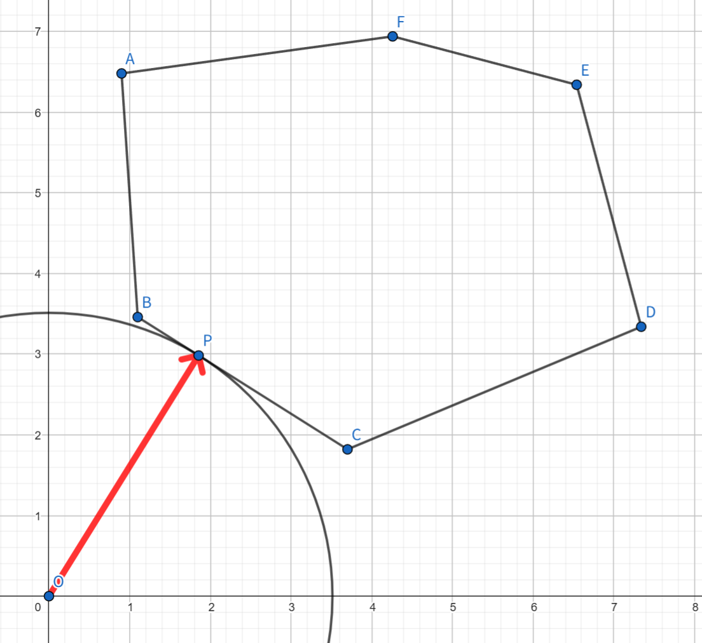
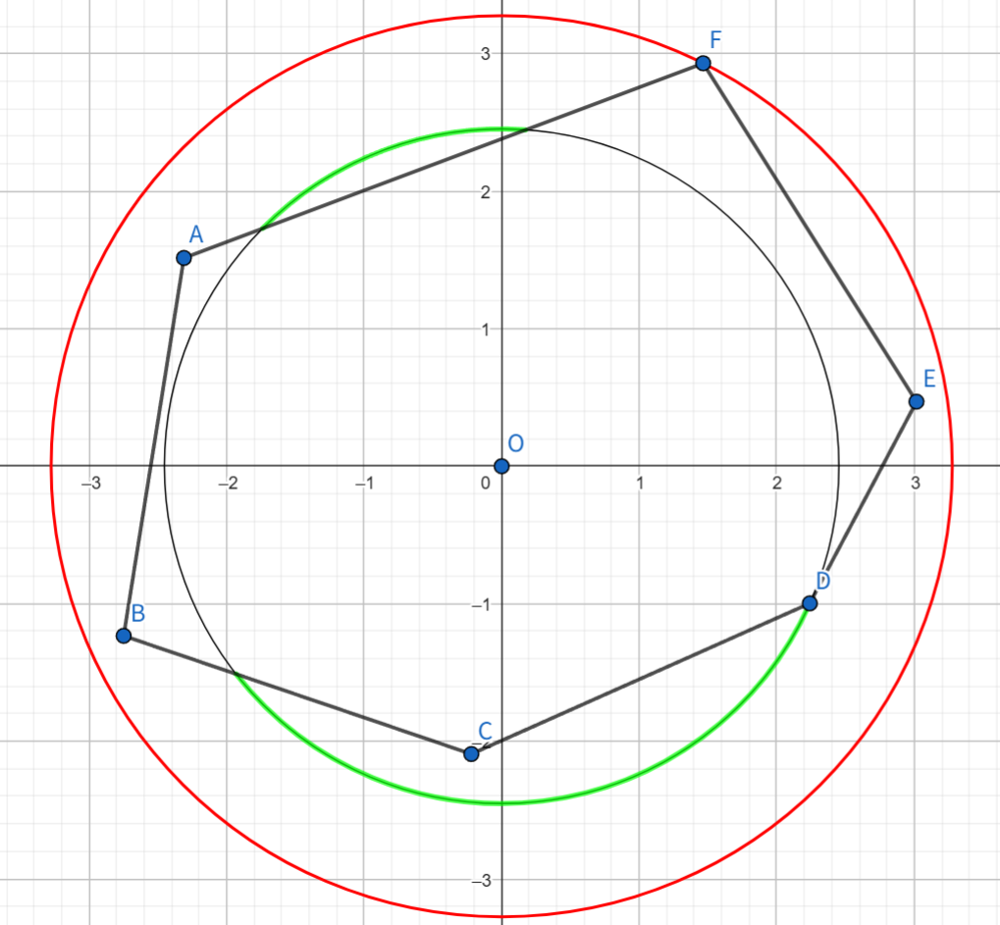
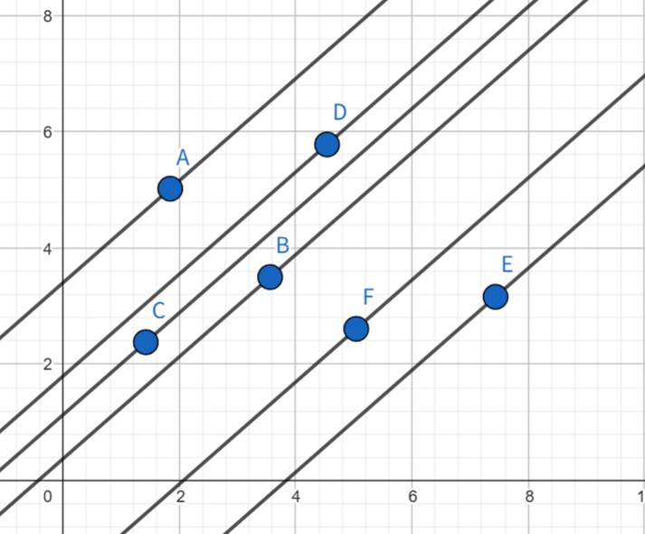
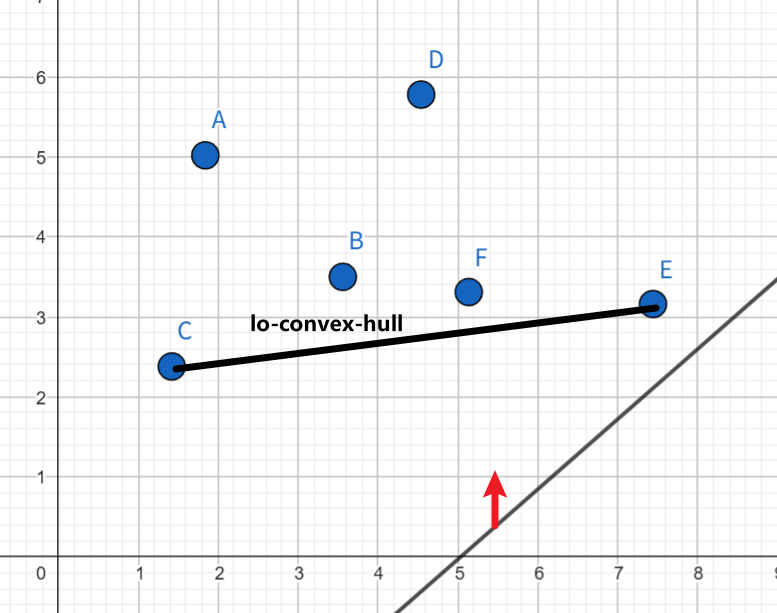

# 牛客多校 2 补题总结

[传送门](https://ac.nowcoder.com/acm/contest/108299)

## Another Day of Sun

### 解法一

简单分析之后，可以发现 $0 \rightarrow 1$ 的过程会使答案加一，所以也就是需要对这个进行计数。

这是一个很有特点的性质，当你插入一个数的时候，只和已有序列的末尾一个数字有关，很强的 dp 指向性，可以用 dp 来解决。$dp(u, 0)$ 表示考虑前 $u$ 个数字，以 $0$ 结尾的序列有多少种，$dp(u, 1)$ 表示考虑前 $u$ 个数字，以 $1$ 结尾的序列有多少种。更新还是很简单的，不说了。注意到可以滚动更新，于是就有：

```cpp
void Thephix() {
    int n;
    cin >> n;
    vector<int> a(n + 1);
    for (int i = 1; i <= n; ++i) {
        cin >> a[i];
    }
    
    Z ans = 0, cnt0 = 1, cnt1 = 0;
    for (int i = 1; i <= n; ++i) {
        tie(cnt0, cnt1) = [&](int op) -> tuple<Z, Z> {
            if (op == 0) return { cnt0 + cnt1, 0 };
            ans += cnt0;
            if (op == 1) return { 0, cnt0 + cnt1 };
            ans += ans - cnt0;
            return { cnt0 + cnt1, cnt0 + cnt1};
        } (a[i]);
    }

    cout << ans << "\n";
}
```

### 解法二

事实上还可以推式子来做。注意到只有 $01$ 会产生贡献，但是你的 $0$ 和 $1$ 也可以是 $-1$。所以如果 $a(u - 1) \neq 1$ 且 $a(u) \neq 0$ 就可以产生贡献，贡献的值等于有多少个序列中这里出现了 $01$。考虑除了这两位以外，如果出现了 $k$ 个 $-1$，那么序列的数量就是 $2^k$，所以：

```cpp
void Thephix() {
    int n;
    cin >> n;

    int k = 0;
    vector<int> a(n + 1);
    for (int i = 1; i <= n; ++i) {
        cin >> a[i];
        k += a[i] == -1;
    }

    Z ans = 0;
    for (int i = 1; i <= n; ++i) {
        if (a[i - 1] != 1 && a[i] != 0) {
            ans += Z(2).pow(k - (a[i] == -1) - (a[i - 1] == -1));
        }
    }

    cout << ans << "\n";
}
```

## Bitwise Perfect

### 解法一

简单分析后会发现，输出 `YES` 当且仅当 $\forall 1 \leq i \lt j \leq n, a_i \oplus a_j \geq \max(a_i, a_j)$。我们直接对 $a$ 排序后，$\max(a_i, a_j) = a_j$，这样我们只需要判断前面的数字中，是否存在一个数 $x$ 满足 $x \oplus a_i \lt a_i$ 即可。我们把前面的数插入到字典树里面，然后查询最小异或对即可。

```cpp
void Thephix() {
    int n;
    cin >> n;
    vector<i64> a(n + 1);
    for (int i = 1; i <= n; ++i) {
        cin >> a[i];
    }
    sort(a.begin() + 1, a.end());

    vector<array<int, 2>> tr(2);
    for (int i = 1; i <= n; ++i) {
        if (i != 1) {
            i64 ans = 0;
            for (int k = 60, p = 1; k >= 0; --k) {
                int x = a[i] >> k & 1;
                if (tr[p][x]) {
                    p = tr[p][x];
                } else {
                    ans |= 1LL << k;
                    p = tr[p][x ^ 1];
                }
            }
            if (ans < a[i]) {
                cout << "NO\n";
                return;
            }
        }
        for (int k = 60, p = 1; k >= 0; --k) {
            int x = a[i] >> k & 1;
            if (tr[p][x] == 0) {
                tr[p][x] = tr.size();
                tr.push_back({});
            }
            p = tr[p][x];
        }
    }
    cout << "YES\n";
}
```

### 解法二

考虑什么时候 $a_i \oplus a_j \lt \max(a_i, a_j)$。注意到如果两个数最高位相同，那么一定是不满足条件的。而最高只有 $60$ 种，所以如果数组长度大于 $60$ 就可以直接输出 `NO` 了，否则对于数组长度小于等于 $60$ 的情况，暴力判断即可。

当然直接暴力也是对的：

```cpp
void Thephix() {
    int n;
    cin >> n;
    vector<i64> a(n + 1);
    for (int i = 1; i <= n; ++i) {
        cin >> a[i];
    }

    for (int i = 1; i <= n; ++i) {
        for (int j = 1; j < i; ++j) {
            if ((a[i] ^ a[j]) < max(a[i], a[j])) {
                cout << "NO\n";
                return;
            }
        }
    }
    cout << "YES\n";
}
```

## Colorful Tree

不会

## Donkey Thinks...

我超，背包，但是怎么这么难

考虑朴素背包，考虑已经使用了 $\sum s$ 的容量的背包的价值：$\sum h - (V - \sum s) \cdot \sum d$ ，那么我往里面多加一包薯片，属性为 $(h', s', d')$，那么新的价值为：

$$
\begin{aligned}
&h' + \sum h - (V - \sum s - s') \cdot (\sum d + d')\\
=& h' + \sum h - (V - \sum s) \cdot \sum d - (V - \sum s) \cdot d' + s'(\sum d + d')\\
=& (\sum h - (V - \sum s) \cdot \sum d) + h' - (V - \sum s) \cdot d' + s'(\sum d + d')
\end{aligned}
$$

所以新增的价值为：$h' - (V - \sum s) \cdot d' + s'(\sum d + d')$，这个价值不仅和背包大小有关，甚至和 $\sum d$ 有关，这太坏了。如果你要做背包 dp 的话，不仅需要维护容量，还需要维护易碎值 $d$，这个 $d$ 的范围是非常大的，这显然不能接受。

题解的解决方案是考虑固定最终背包的容量为 $S$，并且不考虑中间转移的贡献，直接考虑对最终的背包的贡献。这个时候每包薯片的代价都是 $h + (V - S) \cdot d$ ，既然代价固定了就可以直接背包了，这样的时间复杂度是 $O(nV^2)$ 的。

草，这个 $n$ 有点大，于是解决方案是：对于每种体积的薯片，只需要保留最优的一部分。事实上，只需要保留 $\lfloor \frac{S}{s} \rfloor$ 种薯片，这样 $n$ 就被减少为了 $\sum_{i = 1}^{S} \frac{S}{i}$，这是一个调和级数，可以被视为 $S\log S$。这样背包的时间复杂度就变成了 $O(V^3\log V)$ 了。

考虑如何保留最优的部分薯片，如果直接排序，那么在全部薯片都是一种体积的时候会被卡 TLE。正确的操作是 `nth_element` 快速选择，这样每次操作的时间复杂度为 $O(n)$。综上，总时间复杂度为 $O(nV + V^3\log V)$。

```cpp
void Thephix() {
    int n, m;
    cin >> n >> m;
    vector<i64> h(n + 1), s(n + 1), d(n + 1);
    for (int i = 1; i <= n; ++i) {
        cin >> h[i] >> s[i] >> d[i];
    }

    i64 ans = 0;
    for (int S = 0; S <= m; ++S) {
        vector<vector<i64>> item(S + 1);
        for (int i = 1; i <= n; ++i) {
            i64 v = h[i] - d[i] * (m - S);
            i64 w = s[i];
            if (w > S) continue;
            item[w].push_back(v);
        }

        vector<i64> dp(S + 1, -inf);
        dp[0] = 0;
        for (int w = 1; w <= S; ++w) {
            int cnt = min<i64> (S / w, item[w].size());
            nth_element(item[w].begin(), item[w].begin() + cnt, item[w].end(), greater<i64> {});
            for (int i = 0; i < cnt; ++i) {
                for (int j = S; j >= w; --j) {
                    dp[j] = max(dp[j], dp[j - w] + item[w][i]);
                }
            }
        }

        ans = max(ans, dp[S]);
    }
    
    cout << ans << "\n";
}
```

## 	Effective Numbers

神秘的数学题，虽然过了，但是乱搞的，先挖坑，写两种写法

## Field of Fire

好像写成了比较史的模拟：直接枚举操作的位置，那么由于只能影响到上一个着火点和下一个着火点，所以可以 $O(1)$ check。计算不操作的情况下的答案，再考虑每个位置的贡献，计算这个位置带来的贡献，取最大值即可。时间复杂度为 $O(n\log n)$

```cpp
void Thephix() {
    int n, t;
    string s;
    cin >> n >> t >> s;

    if (t >= n - 1) {
        cout << "0\n";
        return;
    }

    vector<int> p;
    for (int i = 0; i < n; ++i) {
        if (s[i] == '1') {
            p.push_back(i);
        }
    }

    auto find = [&](int pos) {
        auto it = lower_bound(p.begin(), p.end(), pos);
        if (it == p.end()) return pair { p.back(), p[0] };
        if (*it == pos) return pair { *it, *it };
        int prv;
        if (it == p.begin()) {
            prv = p.back();
        } else prv = *prev(it);
        return pair { prv, *it };
    };

    int ans = 0;
    vector<array<int, 2>> from(n);
    for (int i = 0; i < n; ++i) {
        auto [prv, nxt] = find(i);
        if (prv > i) prv -= n;
        if (nxt < i) nxt += n;
        from[i][0] = prv + t >= i;
        from[i][1] = nxt - t <= i;
        ans += from[i][0] | from[i][1];
    }

    int res = 0;
    for (int i = 0; i < n; ++i) {
        if (from[i][0] == from[i][1]) {
            continue;
        }
        auto [prv, nxt] = find(i);
        if (prv > i) prv -= n;
        if (nxt < i) nxt += n;
        if (from[i][0]) {
            res = max(res, min(nxt - t - 1, prv + t) - i);
        } else {
            res = max(res, i - max(nxt - t, prv + t + 1));
        }
    }
    cout << (n - ans) + res << "\n";
}
```

## Geometry Friend

给了队友一个超级恶心且错误的结论，先自裁了。

更好的做法是：考虑中心是否在凸包内部，如果不在，那么一定是需要旋转 $360\degree$ 的。



中心在凸包内部，考虑凸包内每个点都要转到下一个凸包上距离相等的弧度。比如下图考虑所有距离为 $|OD|$ 的点，可以发现，只有两个点需要旋转，它们旋转角度分别对应两条绿色的弧。



当我们考虑的距离增大的时候，这个弧度也一定会增大，那么我们只需要考虑距离旋转中心最远的点即可。

```cpp
void Thephix() {
    int n;
    point<i64> o;
    cin >> n >> o;

    vector<point<i64>> convex(n);
    for (int i = 0; i < n; ++i) {
        cin >> convex[i];
    }

    if (!pointInPolygon(o, convex)) {
        cout << 2 * PI << "\n";
        return;
    }

    map<i64, vector<point<i64>>> dis;
    for (int i = 0; i < n; ++i) {
        convex[i] -= o;
        i64 len = dot(convex[i], convex[i]);
        dis[len].push_back(convex[i]);
    }

    f64 ans = 0;
    auto a = dis.rbegin() -> second;
    int m = a.size();
    for (int i = 0; i < m; ++i) {
        point<i64> x = a[i], y = a[(i + 1) % m];
        f64 res = atan2(dot(x, y), cross(x, y));
        if (res < 0) res += 2 * PI;
        ans = max(ans, res);
    }
    if (m == 1) ans = 2 * PI;
    cout << ans << "\n";
}
```

## Highway Upgrade

考虑一条路径，它的代价应该是 $\sum t - k\cdot\max{w}$。如果你直接考虑枚举 $\max w$ 来做，然后只考虑边权小于等于的子图，再求 $\sum t$，这看着就非常不好做。于是考虑直接枚举所有的边，我也不管他是不是路径的最大边 $\max$，反正答案一定在里面，这就对了。

考虑计算一定经过 $(u, v)$ 的最短路径，非常经典的思路是求出 $dist(1, u)$ 和 $dist(v, n)$，再组合一下就行了。这部分可以用 `dijkstra` 求解。

现在你有了一堆的 $(\sum t, w)$ 对，你需要求出使得 $\sum t - k\cdot w$ 最小的一对 $(\sum t, w)$。这条式子长得这么像直线，那么就不妨将它考虑成直线：$\sum t - k \cdot w = b$，你需要做的是让 $b$ 最小，见过斜率优化 dp 的已经秒了。事实上你可以考虑 $\sum t = k\cdot w + b$，在给定一个 $k$ 的情况下，上式其实是一族斜率相等的直线：



如何确定哪个点是我们想要的，只需要使用一条斜率为 $k$ 的直线从下往上移动，碰到的第一个点就是要找的点。注意到这个点一定是在下凸包上的，所以只需要考虑维护下凸包，并在下凸包中找到想要的点即可



在线做法是二分斜率，但是可以离线，所以离线之后双指针一下就行了。

```cpp
void Thephix() {
    int n, m;
    cin >> n >> m;
    vector<array<i64, 4>> edges(m + 1);
    vector<vector<array<i64, 2>>> adj(n + 1);
    vector<vector<array<i64, 2>>> rev(n + 1);
    for (int i = 1; i <= m; ++i) {
        auto& [u, v, t, w] = edges[i];
        cin >> u >> v >> t >> w;
        adj[u].push_back({v, t});
        rev[v].push_back({u, t});
    }

    auto dijkstra = [&](int s, const vector<vector<array<i64, 2>>>& adj) {
        vector<i64> dp (n + 1, inf);
        vector<int> vis(n + 1);
        priority_queue<array<i64, 2>, vector<array<i64, 2>>, greater<array<i64, 2>>> q;
        q.push({ dp[s] = 0, s });
        while (!q.empty()) {
            auto [_, u] = q.top();
            q.pop();
            if (vis[u]) continue;
            vis[u] = 1;
            for (auto [v, w] : adj[u]) {
                if (dp[u] + w < dp[v]) {
                    dp[v] = dp[u] + w;
                    q.push({ dp[v], v });
                }
            }
        }
        return dp;
    };

    auto dp1 = dijkstra(1, adj);
    auto dpn = dijkstra(n, rev);

    vector<point<i128>> points;
    for (int i = 1; i <= m; ++i) {
        auto [u, v, t, w] = edges[i];
        points.push_back({ w, dp1[u] + t + dpn[v] });
    }
    auto hull = Andrew(points).second;

    int q;
    cin >> q;
    vector<array<int, 2>> querys(q + 1);
    for (int i = 1; i <= q; ++i) {
        auto& [k, id] = querys[i];
        cin >> k, id = i;
    }
    sort(querys.begin() + 1, querys.end());

    vector<i64> ans(q + 1);
    for (int i = 1, j = 0; i <= q; ++i) {
        auto [k, id] = querys[i];
        while (
            j + 1 < (int) hull.size()
         && hull[j + 1].y - k * hull[j + 1].x <= hull[j].y - k * hull[j].x
        ) ++j;
        ans[id] = hull[j].y - k * hull[j].x;
    }

    for (int i = 1; i <= q; ++i) {
        cout << ans[i] << "\n";
    }
}
```

## Identical Somehow

签到，我直接被队友灌输了解法，已经是不能自己想了：如果 $x$ 和 $y$ 都不为 $1$，那么答案 $k = 1$，否则无解输出 $-1$，证明如下：

取 $k = 1$，那么 $H(x) = [x \neq 1]$。

那么如果 $x \neq 1$ 且 $y \neq 1$，那么 $k = 1$ 时 $H(x) = H(y) = 1$。

否则不妨考虑 $y = 1$ 而 $x \neq 1$：

- 如果 $k = 1$，那么 $H(y) = 0$。这个时候 $H(x) = 0$ 当且仅当 $x \mid k$ 且 $k \mid x$，即 $x = k = 1$，矛盾
- 如果 $k \neq 1$，那么 $H(y) = 1$。
- * 如果 $x \nmid k$ 且 $k \nmid x$，那么有 $x \bmod k \geq 1$ 和 $k \bmod x \geq 1$，于是 $H(x) \geq 2$。
- * 如果 $x \mid k$ 或 $k \mid x$，不妨令 $k = tx$，则 $H(x) = [t \neq 1]\cdot x$。由于 $x\neq 1$ 有 $H(x) \neq 1$。

```cpp
void Thephix() {
    int x, y;
    cin >> x >> y;
    cout << 2 * (x != 1 && y != 1) - 1 << "\n";
}
```

## Just Curve it

不会

## K-th Memorable Sub-string

这好像是个板子题！

首先前半部分是原：[动物园](https://www.luogu.com.cn/problem/P2375)，把这题学完就会了。其实我也没学明白，该学习 KMP 自动机了。

然后你可以在 $O(n^2)$ 的时间复杂度内预处理出所有合法的子串。查询 kth 的子串，可以使用 SA 来做，也可以用 SAM 来做。但是我都不会！所以考虑使用弱化版的 SAM 来做。众所周知，**插入所有后缀的 trie 树构成了最简易的后缀自动机**，于是就可以用这个做就行了。

挖坑：KMP 自动机，SA，SAM

```cpp
void Thephix() {
    int n, k;
    string s;
    cin >> n >> k >> s;
    
    vector<array<int, 3>> tr(2);
    tr.reserve(1E6);
    for (int i = 0; i < n; ++i) {
        string t = s.substr(i);
        vector<int> fail(n - i);
        for (int j = 1, k = 0; j < n - i; ++j) {
            while (k != 0 && t[j] != t[k]) k = fail[k - 1];
            fail[j] = k += (t[j] == t[k]);
        }
        vector<int> ans(n - i);
        for (int j = 1, k = 0; j < n - i; ++j) {
            while (k != 0 && t[j] != t[k]) k = fail[k - 1];
            k += t[j] == t[k];
            while (k * 2 > j + 1) k = fail[k - 1];
            ans[j] = k;
        }
        for (int j = 0, p = 1; j < n - i; ++j) {
            int x = t[j] - '0';
            if (tr[p][x] == 0) {
                tr[p][x] = tr.size();
                tr.push_back({});
            }
            p = tr[p][x];
            tr[p][2] += ans[j] != 0 && j + 1 - 2 * ans[j] <= k;
        }
    }

    auto dfs = [&](auto&& dfs, int u) -> void {
        if (tr[u][0] != 0) dfs(dfs, tr[u][0]);
        if (tr[u][1] != 0) dfs(dfs, tr[u][1]);
        tr[u][2] += tr[tr[u][0]][2] + tr[tr[u][1]][2];
    };
    dfs(dfs, 1);

    auto siz = [&](int u) -> int {
        return tr[u][2];
    };

    auto cnt = [&](int u) -> int {
        return tr[u][2] - tr[tr[u][0]][2] - tr[tr[u][1]][2];
    };

    int q;
    cin >> q;
    i64 last = 0, total = tr[1][2];
    while (q--) {
        i64 x;
        cin >> x;
        x = (last + x - 1) % total + 1;
        last = 0;

        int p = 1;
        while (x > 0) {
            if (siz(tr[p][0]) >= x) {
                x -= cnt(tr[p][0]);
                p = tr[p][0];
                cout << 0;
                last = (last * 2 + 0) % 998244353;
            } else {
                x -= siz(tr[p][0]) + cnt(tr[p][1]);
                p = tr[p][1];
                cout << 1;
                last = (last * 2 + 1) % 998244353;
            }
        }
        cout << "\n";
    }
}
```

## Love Wins All

注意到给你一个排列，排列对应着一堆环。如果奇数环的数量是 $0$ 个，那么一定是选择其中一个偶数环，删掉其中的两个数，假如这个环大小为 $k$，那么这个环的配对方案是 $(\frac{k}{2})^2$。剩下的偶数环就正常配对，配对方案数为 $1 + [k \neq 2]$

如果奇数环的数量是 $2$ 个，那么一定是对这两个奇数环格子删一个，方案数为两个环大小的乘积 $cnt_1\cdot cnt_2$。剩下的偶数环正常配对，方案数依旧为 $1 + [k \neq 2]$

剩下的情况就是不可能完成的，方案数为 $0$

```cpp
void Thephix() {
    int n;
    cin >> n;
    vector<int> p(n + 1);
    for (int i = 1; i <= n; ++i) {
        cin >> p[i];
    }

    vector<int> vis(n + 1);
    array<vector<int>, 2> siz;
    for (int i = 1; i <= n; ++i) {
        if (vis[i]) continue;
        int cnt = 0;
        for (int j = i; !vis[j]; j = p[j]) {
            cnt += vis[j] = 1;
        }
        siz[cnt & 1].push_back(cnt);
    }
    
    if (siz[1].size() == 0) {
        Z sum = 1, ans = 0;
        for (auto cnt : siz[0]) {
            sum *= 1 + (cnt != 2);
        }
        for (auto cnt : siz[0]) {
            Z res = (1LL * cnt * cnt) / 4;
            ans += sum / (1 + (cnt != 2)) * res;
        }
        cout << ans << "\n";
    } else if (siz[1].size() == 2) {
        Z ans = 1LL * siz[1][0] * siz[1][1];
        for (auto cnt : siz[0]) {
            ans *= 1 + (cnt != 2);
        }
        cout << ans << "\n";
    } else {
        cout << "0\n";
    }
}
```

## Miscalculated Triangles

数位 dp 板子题！

数位 dp 并不只是求某个范围内满足特定条件的数字的个数，因为 dp 的是数位而不是数字。所以你可以考虑计算满足特定条件的三元组 $(a, b, c)$ 的贡献之和。算是对数位 dp 加深了不少理解。

```cpp
void Thephix () {
    string l, s;
    cin >> l >> s;
    reverse(l.begin(), l.end());
    reverse(s.begin(), s.end());

    vector dp (s.size() + 1, array<array<array<array<array <Z, 3>, 2>, 2>, 2>, 2> { });
    vector vis(s.size() + 1, array<array<array<array<array <int, 3>, 2>, 2>, 2>, 2> { });
    auto dfs = [&](auto&& dfs, int p, bool lima, bool limb, bool limc, bool liml, int dis) -> Z {
        if (dis < -1) return 0;
        dis = min(dis, 1);
        if (p == 0) return (dis > 0) * (1 + (!lima && !limb));
        if (vis[p][lima][limb][limc][liml][dis + 1] == 0) {
            vis[p][lima][limb][limc][liml][dis + 1] = 1;
            for (int c = 0; c <= (!limc || s[p - 1] == '1'); ++c) {
                for (int b = 0; b <= (!limb || c == 1); ++b) {
                    for (int a = 0; a <= (!lima || b == 1); ++a) {
                        int add = (p > (int) l.size() ? 0 : l[p - 1] - '0') - (a ^ b ^ c);
                        if (liml == 1 && add < 0) continue;
                        dp[p][lima][limb][limc][liml][dis + 1] += dfs (
                            dfs,
                            p - 1,
                            lima && a == b,
                            limb && b == c,
                            limc && c == s[p - 1] - '0',
                            liml && add == 0,
                            (dis << 1) + a + b - c
                        );
                    }
                }
            }
        }
        return dp[p][lima][limb][limc][liml][dis + 1];
    };

    cout << dfs(dfs, s.size(), 1, 1, 1, l.size() <= s.size(), 0) << "\n";
}
```
